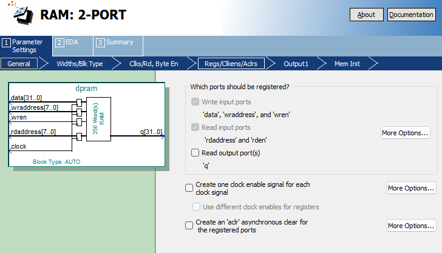
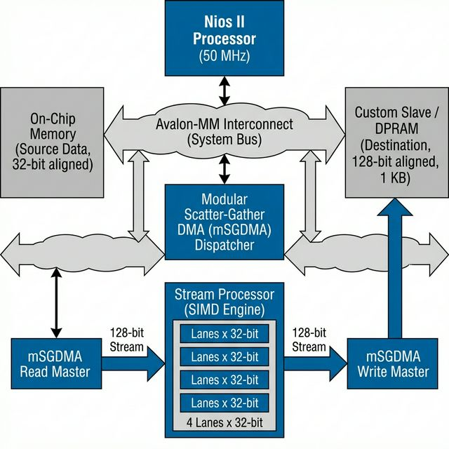

# Nios II Custom Instruction & DMA Acceleration Project

[](https://opensource.org/licenses/MIT)
[](https://www.intel.com/content/www/us/en/products/programmable/fpga/cyclone-v.html)
[](https://www.intel.com/content/www/us/en/products/programmable/processor/nios-ii.html)

> **86x faster** arithmetic acceleration through optimized custom hardware and DMA pipeline

This project demonstrates high-performance FPGA design using **Custom Instructions**, **Modular Scatter-Gather DMA**, and **Avalon Streaming Pipeline** to achieve massive speedups over pure software implementations on Nios II.

## 📚 Documentation

For detailed implementation journey, design decisions, and technical deep-dive:
- [🇺🇸 **English: Implementation Journey**](./doc/history.md)
- [🇰🇷 **Korean: FPGA 프로젝트 검증**](./doc/history_kor.md)

### 📖 Supplemental Docs
- [🚀 **Nios II & DMA Acceleration Guide**](./doc/nios.md)
- [📈 **Burst Master Optimization**](./doc/burst_master.md)
- [🌊 **Stream Processor Pipeline**](./doc/STREAM.md)
- [🔄 **Dynamic PLL Reconfiguration**](./doc/pll.md)
- [📝 **Project Roadmap (TODO)**](./doc/TODO.md)

### Read this in other languages
- [🇰🇷 **한국어 (Korean)**](./doc/README_kor.md)

---

## ✨ Key Features

### 1. **Custom Instruction Unit**
Hardware-accelerated arithmetic unit integrated directly into Nios II CPU pipeline.

**Optimization Highlights:**
- **Target Operation**: `(A × B) / 400`
- **Traditional Approach**: Hardware divider → Setup Time Violations at 50MHz
- **Our Solution**: Shift-Add approximation `(A × 5243) >> 21`
  - Mathematical accuracy: **99.998%** (0.0018% error)
  - **Zero timing violations** even at high frequency
  - Massive cycle reduction vs. software division

### 2. **3-Stage Streaming Pipeline Processor**
Parameterizable N-stage pipeline with robust backpressure handling.

**Architecture:**


```
Stage 0: Input Capture & Endian Swap
   ↓
Stage 1: Coefficient Multiplication (Input × Coeff)
   ↓
Stage 2: Division Approximation & Final Endian Swap
```

**Design Features:**
- **Valid-Ready Handshake**: Industry-standard Avalon-ST backpressure
- **Automatic Byte Swapping**: Resolves mSGDMA endianness mismatch
- **Reusable Template**: [pipe_template.v](./RTL/pipe_template.v) for future projects
- **Timing Closure**: Maintains high throughput while meeting 50MHz+ timing



### 3. **Modular Scatter-Gather DMA Integration**
Disaggregated mSGDMA architecture with inline computation.

**Benefits:**
- **Zero CPU Load**: Calculations happen during DMA transfer
- **Memory Efficiency**: Direct memory-to-memory with transformation
- **Flexible Structure**: Separate Dispatcher, Read Master, Write Master

---

## 🏗️ System Architecture




## 🚀 Performance Results


Benchmarks on Nios II @ 50MHz with 1000-element array processing:

| Mode | Description | Performance vs. Software |
|------|-------------|-------------------------|
| **Bypass** | DMA copy only | **7.59x faster** than CPU memcpy |
| **Full Acceleration** | DMA + Pipeline computation | **86.14x faster** than software division |

**Real Numbers:**
- Software computation: ~860ms
- DMA + Hardware: ~10ms
- **Result: 86x speedup** 🚀

---

## 🧪 Verification Environment

Professional hardware verification using **Cocotb** and **pytest**.

### Features
- ✅ **Python-based testbenches** for flexible test scenarios
- ✅ **Automated waveform generation** (VCD/FST)
- ✅ **Pytest integration** for CI/CD compatibility
- ✅ **Isolated build directories** per module
- ✅ **Behavioral models** for Altera IP (altsyncram)

### Quick Test
```bash
cd tests/cocotb
pytest test_runner.py -v

# Output:
# test_runner.py::test_cocotb_modules[my_custom_slave] PASSED    [50%]
# test_runner.py::test_cocotb_modules[stream_processor] PASSED   [100%]
# ==================== 2 passed in 0.81s ====================
```

### View Waveforms
```bash
# GTKWave
gtkwave tests/cocotb/sim_build/stream_processor/dump.vcd

# Or use VS Code extension: Surfer
```

---

## 📂 Project Structure

```
quartus_project/
├── RTL/
│   ├── stream_processor.v     # 3-Stage Pipeline Accelerator
│   ├── pipe_template.v        # Reusable N-Stage Template
│   ├── my_multi_calc.v        # Custom Instruction Unit
│   ├── my_slave.v             # Avalon-MM Slave w/ DPRAM
│   └── top_module.v           # System Integration
│
├── ip/
│   └── dpram.v                # Dual-Port RAM (1KB)
│
├── software/
│   └── cust_inst_app/
│       └── main.c             # Benchmark & Test Application
│
├── tests/cocotb/
│   ├── test_runner.py         # Pytest Runner
│   ├── tb_my_slave.py         # Avalon-MM Testbench
│   ├── tb_stream_processor_avs.py  # Pipeline Testbench
│   └── sim_models/
│       └── altsyncram.v       # Behavioral Model
│
├── custom_inst_qsys.qsys      # Platform Designer System
├── doc/
│   ├── burst_master.md        # Burst Master Documentation
│   ├── history.md             # Detailed Implementation Guide (EN)
│   ├── history_kor.md         # Detailed Implementation Guide (KR)
│   ├── nios.md                # Nios II Implementation Details
│   ├── pll.md                 # PLL Reconfiguration Details
│   ├── README_kor.md          # Korean README
│   └── TODO.md                # Project TODO List
└── README.md                  # Main English README
```

---

## 🛠️ Quick Start

### Prerequisites
- Intel Quartus Prime (20.1 or later)
- Nios II EDS
- DE10-Nano Board (or Cyclone V FPGA)
- Python 3.8+ with Cocotb (for verification)

### Build FPGA Hardware
```bash
# Open Quartus project
quartus_sh --tcl_eval project_open custom_inst.qpf

# Compile (or use Quartus GUI: Processing → Start Compilation)
quartus_sh --flow compile custom_inst
```

### Build Software
```bash
cd software/cust_inst_app
nios2-app-generate-makefile --bsp-dir ../cust_inst_bsp
make
```

### Program FPGA
```bash
# Via Quartus Programmer or command line
quartus_pgm -c 1 -m JTAG -o "p;output_files/custom_inst.sof"
```

### Run Application
```bash
nios2-terminal  # Connect to UART
# Then from Nios II shell:
./software/cust_inst_app/cust_inst_app.elf
```

---

## 🔬 Technical Highlights

### Challenge 1: Timing Violations
**Problem**: Hardware divider couldn't meet 50MHz timing.

**Solution**: Mathematical transformation using fixed-point approximation:
```
1/400 ≈ 5243/2^21
Error: 0.0018%
Result: Zero timing violations
```

### Challenge 2: Endianness Mismatch
**Problem**: mSGDMA "First Symbol In High-Order Bits" reversed byte order.

**Solution**: Automatic byte-swapping at pipeline input/output:
```verilog
assign swapped = {original[7:0], original[15:8], 
                  original[23:16], original[31:24]};
```

### Challenge 3: Pipeline Backpressure
**Problem**: Data loss when downstream stalls.

**Solution**: Cascaded Valid-Ready handshake through all stages:
```verilog
always @(posedge clk) begin
    if (pipe_ready[N] || !pipe_valid[N])
        stage_data[N] <= stage_data[N-1];
end
```

---

## 📖 Learning Resources

If you're new to FPGA or Nios II development, check out:
1. **[history.md](./doc/history.md)** - Complete design journey with rationale
2. **[pipe_template.v](./RTL/pipe_template.v)** - Reusable pipeline template with detailed comments
3. **Cocotb Tests** - See [tests/cocotb/](./tests/cocotb/) for verification examples

---

## 🤝 Contributing

Contributions are welcome! Areas of interest:
- Additional test cases for edge scenarios
- Support for other FPGA boards
- Enhanced pipeline configurations
- Documentation improvements

---

## 📄 License

MIT License - See [LICENSE](./LICENSE) for details

---

## 🙏 Acknowledgments

- Intel FPGA University Program
- Cocotb open-source verification framework
- VS Code Surfer waveform viewer

