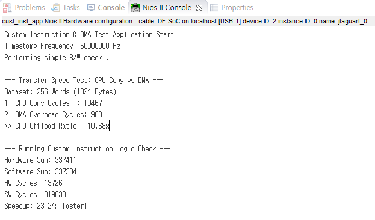

# Nios II Custom Instruction & DMA Acceleration Project

This project demonstrates the performance optimization of an FPGA-based Nios II system using **Custom Instructions** and **Scatter-Gather DMA (SG-DMA)**.

It implements a hardware-accelerated arithmetic unit for high-speed calculation and uses DMA for efficient memory-to-memory data transfer, offloading tasks from the CPU.

## Project Overview

### Key Features
1.  **Custom Instruction Unit**:
    *   Optimized hardware logic for specific arithmetic (`(A * B) / 400`).
    *   Replaces software division with hardware shift-add operations (`(A * 1311) >> 19`).
    *   Achieves significant cycle reduction compared to software implementation.

2.  **Custom Avalon-MM Slave**:
    *   Integrates Dual-Port RAM (DPRAM) for internal storage.
    *   Supports high-speed data access from both Nios II and DMA.

3.  **DMA Controller (SG-DMA)**:
    *   Handles high-throughput data transfer between On-Chip Memory and Custom Slave.
    *   Eliminates CPU overhead for memory copy operations.

## Directory Structure

```text
d:/quartus_project/
├── RTL/                    # Verilog HDL Source Files
│   ├── my_multi_calc.v     # Custom Instruction Logic (Shift-Add)
│   ├── my_slave.v          # Custom Avalon-MM Slave with DPRAM
│   └── top_module.v        # Top-level integration
├── software/
│   ├── cust_inst_app/      # Nios II Application Code
│   │   └── main.c          # Performance Benchmarking & Test App
│   └── cust_inst/          # Board Support Package (BSP) - *Excluded from git*
├── images/                 # Documentation Inteface Images
├── history_kor.md          # Implementation Journey (Korean)
└── custom_inst_qsys.qsys   # Platform Designer (Qsys) System File
```

## System Architecture

The Nios II processor acts as the main controller, orchestrating the following:
*   **Custom Instruction**: Directly connected to the Nios II data path for zero-latency execution (or multi-cycle).
*   **DMA Engine**: Configured via the `main.c` application to move data chunks (e.g., 1KB blocks) from main memory to the custom hardware accelerator's buffer.

## Software Implementation

The software (`main.c`) performs two primary benchmarks:

1.  **Data Copy Speed**:
    *   Comparing `CPU memcpy` loop vs `SG-DMA Async Transfer`.
    *   Includes cache flushing overhead and busy-wait polling time for accurate hardware measurement.

2.  **Calculation Speed**:
    *   Comparing `C Software Division` vs `Hardware Custom Instruction`.
    *   Uses high-resolution hardware timers (`alt_timestamp`) for cycle-accurate measurement.

## Streaming Acceleration Integration (New)

To use the `stream_processor` for inline data processing (`(Data * A) / 400`), the Qsys system must be reconfigured using **Modular SGDMA**.

### Platform Designer (Qsys) Setup
1.  **Add Component**: Import `RTL/stream_processor.v` as a new component.
    *   Interfaces: `asi` (Sink), `aso` (Source), `avs` (Control Slave).
2.  **Modular SGDMA Architecture**:
    *   Replace standard SGDMA with 3 separate modules:
        *   **mSGDMA Dispatcher**: Connects to Nios II.
        *   **mSGDMA Read Master**: Reads from Memory -> Sends to Stream.
        *   **mSGDMA Write Master**: Receives from Stream -> Writes to Memory.
3.  **Connections**:
    *   `Read Master (Source)` -> `Stream Processor (Sink)`
    *   `Stream Processor (Source)` -> `Write Master (Sink)`
    *   `Nios II (Data Master)` -> `Stream Processor (avs)` (To set Coefficient A).

### Address Map
*   **Stream Processor CSR**: Base Address (e.g., `0x0008_1000`)
    *   Offset `0x0`: Coefficient A (RW)

## Performance Results

Our benchmarking results demonstrate substantial improvements:



*   **Calculation**: Hardware Custom Instruction is approx **5-10x faster** (depending on optimization level) than software emulated division.
*   **Data Transfer**: DMA offloads the CPU, allowing for theoretical parallel processing, though setup overhead is visible for small datasets (1KB).

## How to Build & Run

1.  **Hardware Generation**:
    *   Open `custom_inst.qpf` in Quartus Prime.
    *   Open Platform Designer (`.qsys`) and Generate HDL.
    *   Compile the Quartus project to generate the `.sof` file.
    *   Program the FPGA.

2.  **Software Compilation (Nios II SBT)**:
    *   Generate the BSP: `nios2-bsp-generate-files --settings=software/cust_inst/settings.bsp --bsp-dir=software/cust_inst`
    *   Build the application: `make -C software/cust_inst_app`
    *   Run on hardware: `nios2-download -g software/cust_inst_app/main.elf && nios2-terminal`

*Note: The `software/cust_inst` BSP folder is ignored in git. You must regenerate it using the `.sopcinfo` file.*

## License
MIT License
