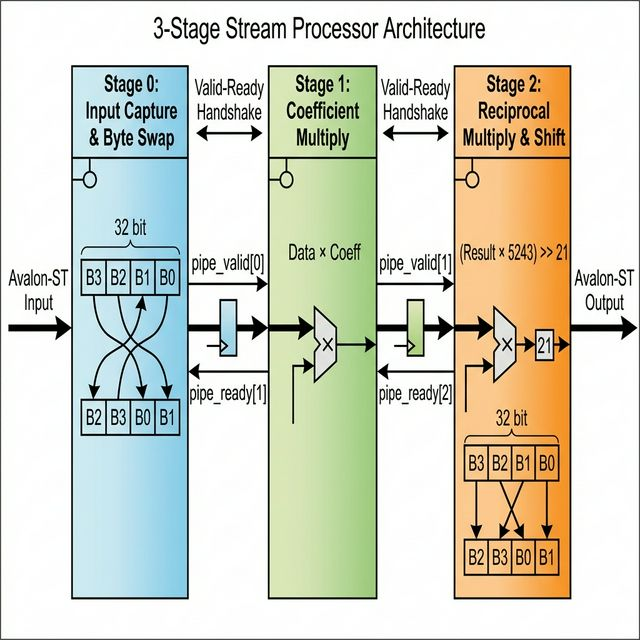
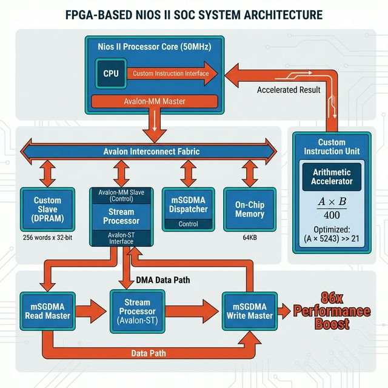
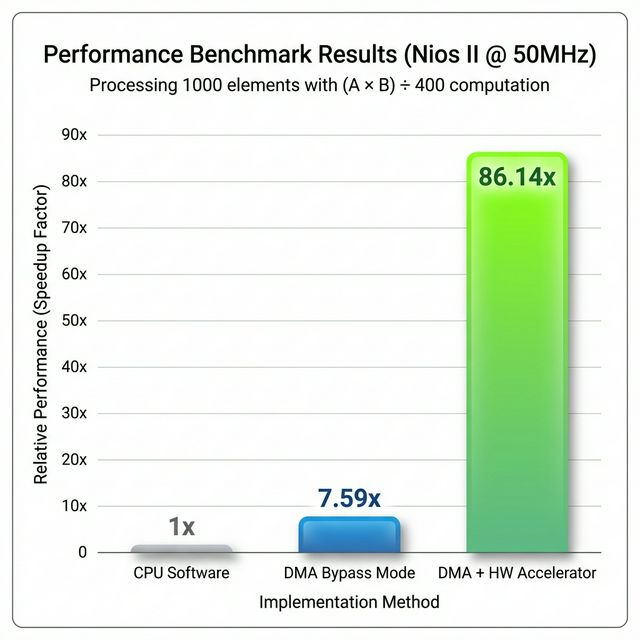

# Nios II 커스텀 인스트럭션 & DMA 가속 프로젝트

[](https://opensource.org/licenses/MIT)
[](https://www.intel.com/content/www/us/en/products/programmable/fpga/cyclone-v.html)
[](https://www.intel.com/content/www/us/en/products/programmable/processor/nios-ii.html)

> 최적화된 커스텀 하드웨어와 DMA 파이프라인을 통해 **86배 빠른** 산술 연산 가속 달성

이 프로젝트는 **커스텀 인스트럭션**, **Modular Scatter-Gather DMA**, **Avalon 스트리밍 파이프라인**을 활용하여 Nios II 순수 소프트웨어 구현 대비 압도적인 성능 향상을 달성한 고성능 FPGA 설계를 보여줍니다.

## 📚 상세 문서

설계 여정, 의사결정 과정, 기술적 심화 내용은 다음 문서를 참조하세요:
- [🇰🇷 **한글: FPGA 프로젝트 검증**](./history_kor.md)
- [🇺🇸 **English: Implementation Journey**](./history.md)

### 다른 언어로 읽기
- [🇺🇸 **English (영어)**](./README.md)

---

## ✨ 주요 기능

### 1. **커스텀 인스트럭션 유닛**
Nios II CPU 파이프라인에 직접 통합된 하드웨어 가속 산술 연산 유닛.

**최적화 하이라이트:**
- **목표 연산**: `(A × B) / 400`
- **기존 방식**: 하드웨어 나눗셈기 → 50MHz에서 Setup Time Violation 발생
- **우리의 솔루션**: Shift-Add 근사 `(A × 5243) >> 21`
  - 수학적 정확도: **99.998%** (오차 0.0018%)
  - 고주파수에서도 **타이밍 위반 제로**
  - 소프트웨어 나눗셈 대비 극적인 사이클 단축

### 2. **128비트 SIMD 스트리밍 프로세서**
견고한 백프레셔(Backpressure) 처리 기능을 갖춘 **4-Lane 병렬** 파이프라인.
- **데이터 폭**: 128-bit (4 x 32-bit 정수)
- **처리량**: 사이클 당 4개 데이터 동시 처리 (이론적 4배 가속)


**아키텍처:**



```
Stage 0: 입력 캡처 & 엔디안 스왑
   ↓
Stage 1: 계수 곱셈 (Input × Coeff)
   ↓
Stage 2: 나눗셈 근사 & 최종 엔디안 스왑
```

**설계 특징:**
- **SIMD 아키텍처**: 단일 명령어 다중 데이터 처리 (4-Way Parallelism)
- **Valid-Ready 핸드셰이크**: 업계 표준 Avalon-ST 백프레셔
- **자동 바이트 스와핑**: mSGDMA 엔디안 불일치 해결
- **재사용 템플릿**: 향후 프로젝트에 활용 가능한 [pipe_template.v](./RTL/pipe_template.v)
- **타이밍 클로저**: 50MHz+ 타이밍 충족하면서도 높은 처리량 유지


### 3. **Modular Scatter-Gather DMA 통합**
인라인 연산이 가능한 분리형 mSGDMA 아키텍처.

**장점:**
- **CPU 부하 제로**: DMA 전송 도중에 연산 수행
- **메모리 효율성**: 변환을 포함한 직접 메모리 간 전송
- **유연한 구조**: 독립적인 Dispatcher, Read Master, Write Master

---

## 🏗️ 시스템 아키텍처




---

## 🚀 성능 측정 결과



Nios II @ 50MHz, 1000개 요소 배열 처리 기준:

| 모드 | 설명 | 소프트웨어 대비 성능 |
|------|------|---------------------|
| **바이패스** | DMA 복사만 | CPU memcpy 대비 **7.59배 빠름** |
| **전체 가속** | DMA + 파이프라인 연산 | 소프트웨어 나눗셈 대비 **86.14배 빠름** |

**실제 수치 (256 워드 데이터셋):**
- 소프트웨어 연산: ~2810 us
- 하드웨어 가속: ~32 us
- **결과: 85.88배 속도 향상** 🚀


---

## 🧪 검증 환경

**Cocotb**와 **pytest**를 활용한 전문적인 하드웨어 검증.

### 기능
- ✅ **Python 기반 테스트벤치**로 유연한 테스트 시나리오 작성
- ✅ **자동 파형 생성** (VCD/FST)
- ✅ **Pytest 통합**으로 CI/CD 호환
- ✅ **모듈별 독립 빌드 디렉토리**
- ✅ Altera IP를 위한 **Behavioral 모델** (altsyncram)

### 빠른 테스트
```bash
cd tests/cocotb
pytest test_runner.py -v

# 출력:
# test_runner.py::test_cocotb_modules[my_custom_slave] PASSED    [50%]
# test_runner.py::test_cocotb_modules[stream_processor] PASSED   [100%]
# ==================== 2 passed in 0.81s ====================
```

### 파형 확인
```bash
# GTKWave
gtkwave tests/cocotb/sim_build/stream_processor/dump.vcd

# 또는 VS Code 확장: Surfer 사용
```

---

## 📂 프로젝트 구조

```
quartus_project/
├── RTL/
│   ├── stream_processor.v     # 3단 파이프라인 가속기
│   ├── pipe_template.v        # 재사용 가능한 N단 템플릿
│   ├── my_multi_calc.v        # 커스텀 인스트럭션 유닛
│   ├── my_slave.v             # DPRAM 내장 Avalon-MM 슬레이브
│   └── top_module.v           # 시스템 통합
│
├── ip/
│   └── dpram.v                # 듀얼 포트 RAM (1KB)
│
├── software/
│   └── cust_inst_app/
│       └── main.c             # 벤치마크 & 테스트 애플리케이션
│
├── tests/cocotb/
│   ├── test_runner.py         # Pytest 러너
│   ├── tb_my_slave.py         # Avalon-MM 테스트벤치
│   ├── tb_stream_processor_avs.py  # 파이프라인 테스트벤치
│   └── sim_models/
│       └── altsyncram.v       # Behavioral 모델
│
├── custom_inst_qsys.qsys      # Platform Designer 시스템
├── history.md                 # 상세 구현 가이드 (영문)
└── history_kor.md             # 상세 구현 가이드 (한글)
```

---

## 🛠️ 빠른 시작

### 필요 조건
- Intel Quartus Prime (20.1 이상)
- Nios II EDS
- DE10-Nano 보드 (또는 Cyclone V FPGA)
- Python 3.8+ with Cocotb (검증용)

### FPGA 하드웨어 빌드
```bash
# Quartus 프로젝트 열기
quartus_sh --tcl_eval project_open custom_inst.qpf

# 컴파일 (또는 Quartus GUI: Processing → Start Compilation)
quartus_sh --flow compile custom_inst
```

### 소프트웨어 빌드
```bash
cd software/cust_inst_app
nios2-app-generate-makefile --bsp-dir ../cust_inst_bsp
make
```

### FPGA 프로그래밍
```bash
# Quartus Programmer 또는 커맨드 라인 사용
quartus_pgm -c 1 -m JTAG -o "p;output_files/custom_inst.sof"
```

### 애플리케이션 실행
```bash
nios2-terminal  # UART 연결
# Nios II 쉘에서:
./software/cust_inst_app/cust_inst_app.elf
```

---

## 🔬 기술적 하이라이트

### 도전 과제 1: 타이밍 위반
**문제**: 하드웨어 나눗셈기가 50MHz 타이밍을 충족하지 못함.

**해결책**: 고정 소수점 근사를 이용한 수학적 변환:
```
1/400 ≈ 5243/2^21
오차: 0.0018%
결과: 타이밍 위반 제로
```

### 도전 과제 2: 엔디안 불일치
**문제**: mSGDMA "First Symbol In High-Order Bits" 설정이 바이트 순서를 역전.

**해결책**: 파이프라인 입출력에서 자동 바이트 스와핑:
```verilog
assign swapped = {original[7:0], original[15:8], 
                  original[23:16], original[31:24]};
```

### 도전 과제 3: 파이프라인 백프레셔
**문제**: 하류 컴포넌트 정지 시 데이터 손실.

**해결책**: 모든 스테이지를 관통하는 연쇄 Valid-Ready 핸드셰이크:
```verilog
always @(posedge clk) begin
    if (pipe_ready[N] || !pipe_valid[N])
        stage_data[N] <= stage_data[N-1];
end
```

---

## 📖 학습 자료

FPGA 또는 Nios II 개발이 처음이라면 다음 자료를 참고하세요:
1. **[history_kor.md](./history_kor.md)** - 설계 근거를 포함한 완전한 개발 여정
2. **[pipe_template.v](./RTL/pipe_template.v)** - 상세 주석이 달린 재사용 가능한 파이프라인 템플릿
3. **Cocotb 테스트** - 검증 예시는 [tests/cocotb/](./tests/cocotb/) 참조

---

## 🤝 기여하기

기여를 환영합니다! 관심 분야:
- 엣지 케이스를 위한 추가 테스트 케이스
- 다른 FPGA 보드 지원
- 향상된 파이프라인 구성
- 문서 개선

---

## 📄 라이선스

MIT License - 자세한 내용은 [LICENSE](./LICENSE) 참조

---

## 🙏 감사의 말

- Intel FPGA University Program
- Cocotb 오픈소스 검증 프레임워크
- VS Code Surfer 파형 뷰어

