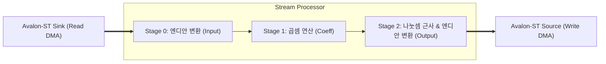
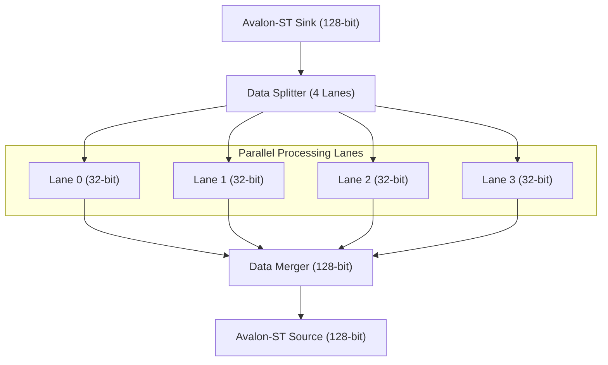

# Stream Processor: 고속 데이터 처리 파이프라인

[⬅️ 메인 README로 돌아가기](../README.md) | [🇰🇷 한글 메인](./README_kor.md)

## 1. 개요

`stream_processor`는 Avalon Streaming (Avalon-ST) 인터페이스를 통해 유입되는 데이터를 하드웨어 파이프라인에서 실시간으로 처리하는 모듈입니다. 본 모듈은 단순한 데이터 전달을 넘어, 곱셈 및 나눗셈(근사) 연산을 수행하면서도 **Backpressure(흐름 제어)**를 완벽하게 지원합니다.

### 핵심 특징
- **3단 파이프라인 (3-Stage Pipeline)**: 연산 부하를 분산하여 고속 동작 가능
- **Avalon-ST 인터페이스**: DMA와 직접 연결되어 스트리밍 데이터 처리
- **Handshake Flow Control**: Valid/Ready 신호를 통한 안전한 데이터 전송
- **엔디안 변환 (Endian Swap)**: 시스템 간 데이터 호환성 보장

---

## 2. 하드웨어 아키텍처

`stream_processor`는 다음과 같은 3단계 파이프라인으로 구성됩니다.



### 각 단계별 역할

1. **Stage 0 (Input stage)**: 유입된 32비트 데이터를 빅 엔디안 ↔ 리틀 엔디안 변환합니다. 이는 프로세서(Nios II)와 하드웨어 연산기 간의 데이터 정렬을 맞추기 위함입니다.
2. **Stage 1 (Processing stage)**: 설정된 `coeff_a` 값을 데이터에 곱합니다. 만약 `bypass` 모드가 활성화되어 있다면 원본 데이터를 그대로 다음 단계로 넘깁니다.
3. **Stage 2 (Output stage)**: 곱해진 결과에 대해 나눗셈 근사 연산(`/ 400`)을 수행하고, 다시 엔디안을 변환하여 출력합니다.

---

## 3. 인터페이스 명세

### Avalon-MM Slave (CSR: Control Status Register)
소프트웨어(Nios II)가 하드웨어의 동작을 설정하고 상태를 확인하는 인터페이스입니다.

| 주소 (Offset) | 이름 | R/W | 설명 |
|---|---|---|---|
| `0x0` | Coefficient A | R/W | 연산에 사용될 계수 (기본값: 버전 정보) |
| `0x1` | Bypass | R/W | Bit 0: 1일 때 연산을 무시하고 전달 |
| `0x2` | Valid Count | R | 입력된 유효 데이터의 총 개수 (디버깅용) |
| `0x3` | Last Data | R | 마지막으로 처리된 데이터 값 (디버깅용) |

### Avalon-ST (Streaming Interface)
데이터가 실제로 흐르는 고속 통신 경로입니다.

- **Sink (Input)**: `asi_valid`, `asi_data`, `asi_ready`
- **Source (Output)**: `aso_valid`, `aso_data`, `aso_ready`

---

## 4. 핵심 기술: Valid-Ready Handshake

파이프라인의 각 단계가 꽉 찼을 때 데이터 유실을 방지하기 위해 **Handshake** 로직을 사용합니다.

```verilog
// 파이프라인 Ready 신호 생성 (Backpressure)
assign pipe_ready[i] = !pipe_valid[i] || pipe_ready[i+1];
```

- **해석**: "내가 데이터를 가지고 있지 않거나(`!pipe_valid`), 내 다음 단계가 준비되었다면(`pipe_ready[i+1]`), 나는 새로운 데이터를 받을 수 있다(`pipe_ready[i]`)."
- 이 로직을 통해 출력 FIFO나 메모리가 느려져서 `aso_ready`가 Low가 되면, 그 압력이 파이프라인을 타고 거꾸로 전달되어 입력을 자동으로 멈추게 합니다.

---

## 5. 수학적 원리: 나눗셈 근사

하드웨어에서 나눗셈(`/`) 연산은 리소스를 많이 차지하고 속도가 느립니다. 이를 최적화하기 위해 **역수 곱셈** 방식을 사용합니다.

- **목표**: `x / 400` 계산
- **변환**: `x * (1/400)`
- **정수 연산화**: `x * (5243 / 2^21)` ≈ `x / 400`

```verilog
// Stage 2의 핵심 연산 로직
auto_res_calc = (intermediate_prod * 64'd5243) >> 21;
```
이렇게 하면 복잡한 나눗셈기 없이 곱셈기와 시프트 연산만으로 매우 빠르게 결과를 얻을 수 있습니다.

---

## 6. 실전 활용 (C Code)

Nios II에서 `stream_processor`를 제어하는 예제 코드입니다.

```c
#include "io.h"
#include "system.h"

// 1. 계수 설정 (예: 100 곱하기)
IOWR(STREAM_PROCESSOR_BASE, 0, 100);

// 2. 바이패스 모드 해제 (연산 활성화)
IOWR(STREAM_PROCESSOR_BASE, 1, 0);

// 3. 디버깅: 처리된 데이터 개수 확인
uint32_t count = IORD(STREAM_PROCESSOR_BASE, 2);
printf("Processed %d words\n", count);
```

---

## 8. SIMD 확장: stream_processor_simd

`stream_processor_simd`는 기존 32비트 연산기를 **128비트 대역폭**으로 확장한 고성능 버전입니다. **SIMD (Single Instruction, Multiple Data)** 개념을 적용하여, 한 번의 클럭 사이클에 4개의 데이터를 동시에 처리합니다.

### SIMD 아키텍처



### 주요 개선 사항
1. **4개 레인 병렬 처리**: 128비트 입력을 4개의 32비트 데이터로 쪼개어 각각 독립적인 연산 유닛에서 처리합니다.
2. **공유 제어 로직**: 파이프라인의 Valid/Ready Handshake와 CSR 설정은 모든 레인이 공유하여 리소스 효율을 높였습니다.
3. **처리량 4배 향상**: 동일한 클럭 속도에서 일반 버전보다 4배 더 많은 데이터를 처리할 수 있습니다.

### 성능 비교

| 항목 | Basic (32-bit) | SIMD (128-bit) | 비고 |
|---|---|---|---|
| 데이터 버스 폭 | 32-bit | 128-bit | 4배 확장 |
| 클럭당 처리량 | 1 Word | 4 Words | 대역폭 활용 극대화 |
| 파이프라인 단계 | 3 Stages | 3 Stages | 지연 시간 동일 |
| 메모리 요구량 | Low | High | mSGDMA 128-bit 지원 필요 |

### SIMD 전용 레지스터 (CSR)
SIMD 버전은 하드웨어 식별을 위해 상태 레지스터가 약간 다르게 구성되어 있습니다.

- `0x0`: **Version** (SIMD 버전: `0x00010200`)
- `0x3`: **Marker** (`0x514D0128`) - "SIMD 128"을 의미하는 식별값

---

## 9. Deep Dive: 핵심 로직 분석

`stream_processor_simd`의 고성능 병렬 처리를 가능하게 하는 두 가지 핵심 로직을 자세히 살펴봅니다.

### 9.1. Backpressure Chain (역방향 흐름 제어)

파이프라인의 각 단계가 꽉 찼을 때 데이터 유실을 막는 핵심 수식입니다. `generate` 문을 통해 모든 스테이지에 연쇄적으로 적용됩니다.

```verilog
assign pipe_ready[i] = !pipe_valid[i] || pipe_ready[i+1];
```

- **논리 분석**:
    - `!pipe_valid[i]`: "현재 스테이지가 비어있다." 비어있으면 언제든 데이터를 받을 수 있습니다.
    - `pipe_ready[i+1]`: "다음 스테이지가 준비되었다." 내 데이터가 다음으로 넘어갈 수 있으니, 나도 비워지게 되어 새로운 데이터를 받을 수 있습니다.
- **연쇄 반응 (Ripple Effect)**: 최종 출력인 `aso_ready`가 Low가 되면, `pipe_ready[2]` → `pipe_ready[1]` → `pipe_ready[0]` 순으로 즉시 Low가 전파되어 `asi_ready`가 입력을 차단합니다.

### 9.2. Shared Pipeline Valid Control (공유 제어 로직)

SIMD 구조에서는 4개의 레인이 동일한 명령(곱셈/나눗셈)을 수행하므로, 각 레인마다 제어 로직을 만들지 않고 **하나의 Valid 제어기**를 공유합니다.

```verilog
// Stage 0 Valid Control
if (pipe_ready[0]) begin
    pipe_valid[0] <= asi_valid;
    if (asi_valid) in_count <= in_count + 4; // 128비트 = 4개 데이터 한꺼번에 카운트
end
```

- **효율성**: 제어 로직 리소스를 1/4로 절감하면서도, 모든 레인이 완벽한 **Lock-step(동기화)** 방식으로 동작하게 합니다.
- **일반화된 제어 로직**: 첫 스테이지 이후의 모든 중간 스테이지(`i > 0`)는 다음과 같은 공통된 로직으로 유효 비트를 전달합니다.

```verilog
// 중간 스테이지 (i > 0)의 유효 비트 전달 로직
if (pipe_ready[i]) begin
    pipe_valid[i] <= pipe_valid[i-1]; // 이전 단계의 Valid를 그대로 복사
end
```

- **흐름의 핵심**: 
    1. 현재 단계가 비워지거나 다음 단계가 받을 준비가 되면(`pipe_ready[i]`)
    2. 이전 단계의 상태(`pipe_valid[i-1]`)를 현재 단계(`pipe_valid[i]`)로 밀어넣습니다.
    3. 이를 통해 데이터와 Valid 비트가 클럭마다 파이프라인 한 칸씩 정교하게 이동하게 됩니다.
- **카운팅**: 128비트 데이터 하나가 들어올 때마다 실제 데이터 개수인 4씩 카운트를 증가시켜 소프트웨어에서 정확한 처리량을 알 수 있게 합니다.

---

## 10. 결론

`stream_processor` 시리즈는 FPGA의 강력한 병렬 처리 능력을 보여주는 좋은 예시입니다. 단순한 32비트 파이프라인에서 시작하여 128비트 SIMD로 확장하는 과정은 데이터 집약적인 알고리즘을 하드웨어로 가속할 때 필수적인 설계 패턴입니다.
