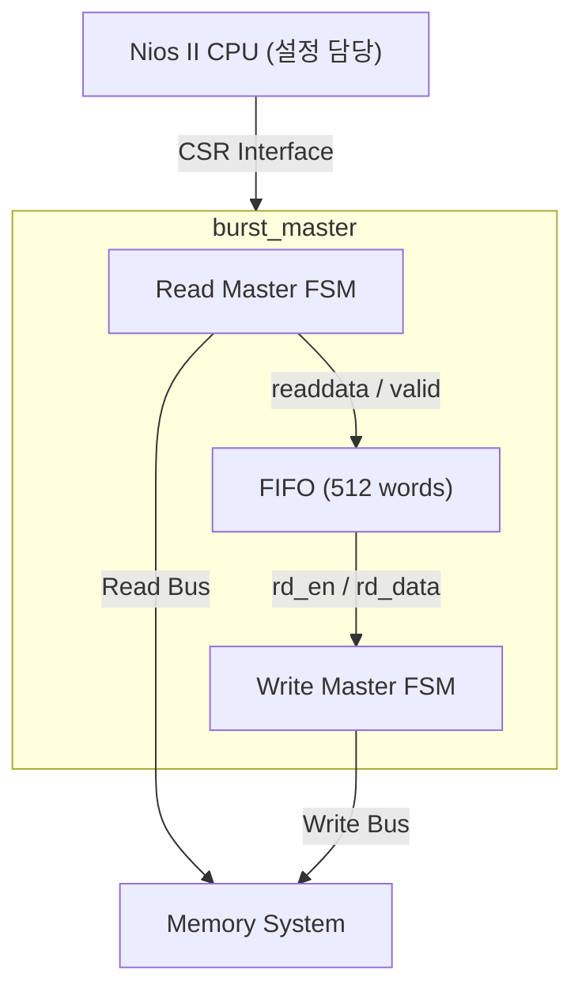
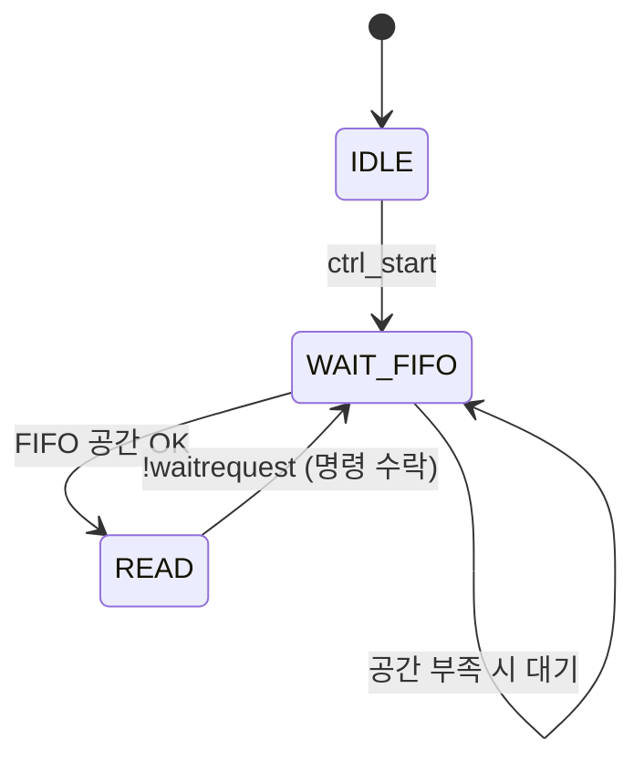
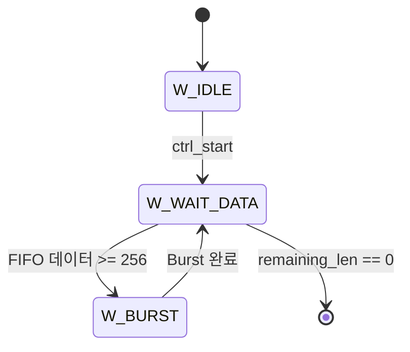
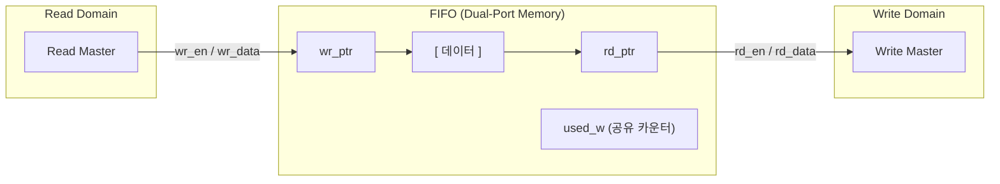

# Burst Master DMA 컨트롤러 강의

[⬅️ 메인 README로 돌아가기](../README.md) | [🇰🇷 한글 메인](./README_kor.md)

## 목차
1. [개요](#개요)
2. [핵심 개념: Burst Transfer](#핵심-개념-burst-transfer)
3. [아키텍처: 동시 실행의 핵심, FIFO 기반 설계](#아키텍처-동시-실행의-핵심-fifo-기반-설계)
4. [Read Master와 Write Master의 병렬 동작](#read-master와-write-master의-병렬-동작)
5. [Pipelined 프로토콜과 Pending Reads](#pipelined-프로토콜과-pending-reads)
6. [상세 동작 분석](#상세-동작-분석)
7. [타이밍 다이어그램](#타이밍-다이어그램)
8. [burst_master_2: 성능 최적화 버전](#burst_master_2-성능-최적화-버전)
9. [burst_master_3: 데이터 처리 파이프라인 추가](#burst_master_3-데이터-처리-파이프라인-추가)
10. [기능 확장: Programmable Burst Length](#기능-확장-programmable-burst-length)
11. [burst_master_4: Multi-Cycle Pipeline (Handshake)](#burst_master_4-multi-cycle-pipeline-handshake)
12. [추가 학습 자료](#추가-학습-자료)
13. [실전 개발 팁: 시뮬레이션 및 디버깅](#실전-개발-팁-시뮬레이션-및-디버깅)

---

## 개요

`burst_master`는 Avalon Memory-Mapped (Avalon-MM) 인터페이스를 사용하여 메모리 간 고속 데이터 복사를 수행하는 **DMA (Direct Memory Access)** 컨트롤러입니다.

**DMA의 목적**: CPU를 거치지 않고 메모리 간 직접 데이터 전송
- CPU는 DMA에 "Source, Destination, Length"만 알려줌
- DMA가 독립적으로 데이터를 복사
- CPU는 다른 작업 수행 가능 (병렬 처리)

---

## 핵심 개념: Burst Transfer

### 일반적인 메모리 전송

매번 주소와 데이터를 하나씩 전송:

```
[Addr 0x1000] -> [Data 0xAA]
[Addr 0x1004] -> [Data 0xBB]
[Addr 0x1008] -> [Data 0xCC]
...
```

**문제점**: 주소 전송 오버헤드가 큼 (주소:데이터 = 1:1)

### Burst Transfer

주소를 한 번만 전송하고, 데이터를 연속으로 N개 전송:

```
[Addr 0x1000, BurstCount=256] ->
    [Data 0xAA][Data 0xBB][Data 0xCC]...[Data 256개]
```

**장점**:
- 주소 전송: 1번
- 데이터 전송: 256번
- **버스 효율: 256배 향상!**

**`burst_master` 설정**:
- `BURST_COUNT = 256` (한 Burst당 256 워드 = 1KB)
- 1MB 전송 시: 주소 전송 1024번 (vs. 일반 방식 262,144번)

---

## 아키텍처: 동시 실행의 핵심, FIFO 기반 설계

### 기본 구조



### FIFO의 역할

**1. 속도 완충 (Buffering)**
- Read가 빠르고 Write가 느릴 때: FIFO에 데이터가 쌓임 → Read는 FIFO 공간이 생길 때까지 대기
- Write가 빠르고 Read가 느릴 때: FIFO가 비워짐 → Write는 FIFO가 (다시) 채워질 때까지 대기

**2. 도메인 분리 (Decoupling)**
- Read Master와 Write Master가 **독립적으로** 동작
- 서로의 속도에 영향받지 않음

**3. Burst 모으기**
- Write Master는 FIFO에 256개 데이터가 쌓일 때까지 대기
- 데이터가 모이면 한 번에 Burst 전송

---

## Read Master와 Write Master의 병렬 동작

### 핵심: 두 FSM이 동시에 실행됨!

**중요한 개념**: Read Master와 Write Master는 **같은 클럭**에서 동작하지만, **독립적인 상태**를 가집니다.

```verilog
// 두 FSM이 각자의 state를 독립적으로 유지
reg [1:0] rm_state;  // Read Master State
reg [1:0] wm_fsm;    // Write Master State

always @(posedge clk) begin
    // Read Master 로직
    case (rm_state)
        // ...
    endcase
end

always @(posedge clk) begin
    // Write Master 로직
    case (wm_fsm)
        // ...
    endcase
end
```

### 동시 실행 시나리오

**시간 t0**: 전송 시작
- Read Master: `READ` 상태, 첫 번째 Burst 요청 전송
- Write Master: `W_WAIT_DATA` 상태, FIFO 데이터 대기

**시간 t1**: 첫 번째 Burst 요청 수락 (데이터는 아직 안 옴!)
- Read Master: `WAIT_FIFO` → 즉시 `READ` 상태, **두 번째 Burst 요청 전송**
- Write Master: 여전히 `W_WAIT_DATA` (FIFO 비어있음)
- **★ Pipelined 프로토콜: 요청과 데이터 수신이 분리됨**

**시간 t2**: 첫 번째 Burst 데이터 도착 시작
- Read Master: 두 번째 Burst 요청까지 전송 완료, 세 번째는 **FIFO 공간 부족으로 대기 중**
  - `pending_reads = 512` (Burst #1, #2)
  - `fifo_used = 0`이므로 Burst #3 요청 시 512 + 256 = 768 > 512 ❌
- Write Master: 여전히 `W_WAIT_DATA` (아직 256개 안 모임)
- FIFO: 데이터 채워지기 시작 (Burst #1 데이터)

**시간 t3**: FIFO에 256개 데이터 쌓임 (Burst #1 완료)
- Read Master: **여전히 WAIT_FIFO에서 대기 중**
  - `pending_reads = 256` (Burst #2만 남음)
  - `fifo_used = 256`
  - Burst #3 요청 시: 256 + 256 + 256 = 768 > 512 ❌ (여전히 불가)
- Write Master: `W_BURST` 상태로 전환, 첫 번째 Burst 쓰기 시작
  - FIFO에서 데이터를 가져가기 시작 → `fifo_used` 감소

**시간 t4**: Write가 소비하면서 공간 확보 (정상 상태 진입)
- Read Master: Write가 일부 소비하여 공간 확보 → **Burst #3 요청 가능!**
  - 예: `fifo_used = 200`, `pending_reads = 200` (Burst #2 일부 도착)
  - Burst #3 요청: 200 + 200 + 256 = 656... 여전히 대기
  - **실제로는**: Write가 Burst #1을 거의 다 소비하고, Burst #2가 거의 다 도착한 후에야 Burst #3 가능
- Write Master: Burst #1 쓰기 완료 후 Burst #2 시작
- **★ 이제부터 Read/Write가 번갈아가며 진행 (완전한 병렬은 아님)**
- FIFO: 256~512 사이를 오가며 버퍼 역할

### 병렬 동작의 이점

**순차 실행 (FIFO 없이)**:
```
Read Burst 1 (100 cycles)
  -> Write Burst 1 (100 cycles)
    -> Read Burst 2 (100 cycles)
      -> Write Burst 2 (100 cycles)
        ...
전체 시간: 200 cycles × N bursts
```

**병렬 실행 (FIFO 있음)**:

```mermaid
gantt
    title Parallel Execution Concept
    dateFormat  X
    axisFormat %s
    section Read Domain
    Read Burst 1    :active, r1, 0, 100
    Read Burst 2    :active, r2, 100, 200
    Read Burst 3    :active, r3, 200, 300
    section Write Domain
    Write Burst 1   :w1, 50, 150
    Write Burst 2   :w2, 150, 250
    Write Burst 3   :w3, 250, 350
```



**성능 향상**: 거의 **2배** (이론적으로)

**성능 향상**: 거의 **2배** (이론적으로)

---

## Pipelined 프로토콜과 Pending Reads

### Avalon-MM의 Pipelined 특성

**일반적인 오해**: "Read 명령을 보내면 바로 데이터가 온다"

**실제**:
```
Cycle 1: rm_read=1, rm_address=0x1000 (명령 전송)
Cycle 2: rm_waitrequest=0 (명령 수락)
Cycle 3: (아직 데이터 없음)
Cycle 4: (아직 데이터 없음)
Cycle 5: rm_readdatavalid=1, rm_readdata=0xAA (데이터 도착!)
```

**중요**: 명령과 데이터 사이에 **수 클럭의 지연**이 있습니다!

### 문제: FIFO Overflow 위험

**시나리오**:
1. FIFO에 100개 공간 남음
2. Read Master가 256개 Burst 요청 #1 전송
3. FIFO 공간 충분해 보임 (아직 데이터 안 왔으므로)
4. Read Master가 256개 Burst 요청 #2 전송
5. 나중에 512개 데이터가 한꺼번에 도착
6. **FIFO Overflow!** (512개 > 100개 공간)

### 해결책: Pending Reads 추적

**개념**: "요청은 보냈지만 아직 안 온 데이터" 개수 추적

```verilog
reg [ADDR_WIDTH-1:0] pending_reads;

// 명령 수락 시: Pending에 추가
if (rm_state == READ && !rm_waitrequest) begin
    pending_reads <= pending_reads + BURST_COUNT;
end

// 데이터 수신 시: Pending에서 차감
if (rm_readdatavalid) begin
    pending_reads <= pending_reads - 1;
end

// FIFO 공간 체크 시 Pending 고려
if ((fifo_used + pending_reads + BURST_COUNT) <= FIFO_DEPTH) begin
    // 새 Burst 요청 가능
end
```

**예시**:
- FIFO 사용: 100개
- Pending: 256개 (Burst #1)
- 새 요청: 256개 (Burst #2)
- 합계: 100 + 256 + 256 = 612개
- FIFO 깊이: 512개
- **결과**: 612 > 512, 새 요청 **거부** ✓

이렇게 하면 FIFO Overflow를 **확실히 방지**할 수 있습니다.

---

## 상세 동작 분석

### Read Master FSM

**상태 다이어그램**:


**각 상태의 동작**:

1. **IDLE**: 시작 대기
   - `ctrl_start` 신호를 polling
   - Start 감지 시 주소/길이 래치

2. **WAIT_FIFO**: FIFO 공간 확인
   - 조건: `(fifo_used + pending_reads + BURST_COUNT) <= FIFO_DEPTH`
   - 공간 충분 → `READ` 상태로
   - 공간 부족 → 대기 (FIFO가 비워질 때까지)

3. **READ**: Burst 읽기 명령 전송
   - `rm_read = 1`, `rm_address` 설정
   - `!rm_waitrequest` 감지 시:
     - 주소 += 1KB
     - 남은 길이 -= 1KB
     - `WAIT_FIFO`로 복귀

**핵심 포인트**:
- Read Master는 **가능한 한 빨리** 데이터를 읽어옴 (선제적)
- FIFO 공간만 있으면 계속 Burst 요청
- 이를 통해 **Read 대역폭을 최대로 활용**

### Write Master FSM

**상태 다이어그램**:


**각 상태의 동작**:

1. **W_IDLE**: 시작 대기
   - `ctrl_start` 신호를 polling
   - Start 감지 시 주소/길이 래치

2. **W_WAIT_DATA**: FIFO 데이터 확인
   - 조건: `fifo_used >= BURST_COUNT`
   - 데이터 충분 → `W_BURST` 상태로
   - 데이터 부족 → 대기 (Read가 채울 때까지)
   - `remaining_len == 0` → 완료!

3. **W_BURST**: Burst 쓰기 수행
   - `wm_write = 1` 유지
   - 매 클럭 `!wm_waitrequest`이면:
     - FIFO에서 데이터 읽기 (`fifo_rd_en = 1`)
     - word_cnt 증가
   - 256개 전송 완료:
     - 주소 += 1KB
     - 남은 길이 -= 1KB
     - `W_WAIT_DATA`로 복귀

**핵심 포인트**:
- Write Master는 **FIFO가 충분히 쌓일 때까지** 대기 (보수적)
- 256개가 모이면 한 번에 Burst 전송
- 이를 통해 **Write Burst 효율 극대화**

### FIFO의 중재 역할

**FIFO는 두 독립적인 도메인을 연결**:



**동시 Write/Read**:
- Read Master가 FIFO에 쓰는 동시에
- Write Master가 FIFO에서 읽을 수 있음
- `used_w` 카운터가 정확히 업데이트됨

```verilog
// FIFO 내부 로직
if (wr_en && !full && (!rd_en || empty)) begin
    used_w <= used_w + 1;  // Write만
end else if (rd_en && !empty && (!wr_en || full)) begin
    used_w <= used_w - 1;  // Read만
end
// 동시 Write/Read이면 used_w 유지 (증감 상쇄)
```

---

## 타이밍 다이어그램

### 전체 전송 과정 (1KB 전송 예시)

```mermaid
gantt
    title 1KB Burst Transfer Timing
    dateFormat  X
    axisFormat %s
    
    section Read Master
    IDLE/Wait FIFO :0, 10
    Read Command   :active, r_cmd, 10, 20
    section Data valid
    Data Receive   :r_data, 20, 60
    section Write Master
    IDLE/Wait Data :0, 50
    Write Burst    :active, w_burst, 50, 110
```



**주요 이벤트**:
1. **Cycle 0**: Start 신호, 양쪽 FSM 시작
2. **Cycle 10**: Read Burst 명령 전송
3. **Cycle 20**: 첫 데이터 도착, FIFO 채우기 시작
4. **Cycle 50**: FIFO 256개 도달, Write Burst 시작
5. **Cycle 50~110**: Read와 Write 동시 진행
   - Read는 이미 완료했지만
   - Write는 아직 진행 중
   - **비대칭 동작의 예**

### Pending Reads 동작

```mermaid
gantt
    title Pending Reads & FIFO Used
    dateFormat  X
    axisFormat %s
    
    section Read Master
    Burst Req #1   :crit, req1, 5, 10
    Burst Req #2   :crit, req2, 15, 20
    
    section Pending
    Pending (256)  :p1, 10, 20
    Pending (512)  :p2, 20, 30
    
    section FIFO
    FIFO Used (Data):fill, 20, 35
```



**설명**:
- Pending은 "요청했지만 안 온 데이터"를 추적
- 데이터가 도착하면 Pending 감소, FIFO Used 증가
- 두 값의 합(`fifo_used + pending_reads`)이 실제 필요한 공간

---

## 요약

### 핵심 설계 원칙

1. **병렬화 (Parallelization)**
   - Read와 Write를 독립적인 FSM으로 분리
   - FIFO를 통해 도메인 분리
   - 최대 2배 성능 향상

2. **선제적 읽기 (Eager Reading)**
   - Read Master는 가능한 한 빨리 데이터를 읽어옴
   - FIFO를 미리 채워두어 Write가 대기하지 않도록

3. **Burst 효율 극대화**
   - Write는 256개가 모일 때까지 대기
   - 한 번의 주소 전송으로 256개 데이터 전송
   - 버스 오버헤드 최소화

4. **안전한 Flow Control**
   - Pending Reads로 FIFO Overflow 방지
   - `used_w` 카운터로 정확한 FIFO 상태 추적
   - Waitrequest 신호로 Slave 속도에 적응

### 성능 특성

**최적 조건** (Read와 Write 속도가 비슷할 때):
- 이론적 성능: 순차 실행 대비 **2배**
- 실제 성능: Overhead 고려 시 **1.7~1.9배**

**Read가 Write보다 빠를 때**:
- FIFO가 채워짐
- Write 속도가 병목
- 성능: Write 속도에 의존

**Write가 Read보다 빠를 때**:
- FIFO가 비워짐
- Read 속도가 병목
- 성능: Read 속도에 의존

**FIFO 크기 선택**:
- 512 = 2 × BURST_COUNT
- Write가 한 Burst 쓰는 동안 Read가 다음 Burst 준비 가능
- 적절한 버퍼링으로 병렬 동작 보장

---

## burst_master_2: 성능 최적화 버전

### 개요

`burst_master_2`는 `burst_master`의 **성능 향상 버전**으로, **Back-to-Back Burst Transfer**를 구현하여 상태 전환 오버헤드를 제거합니다.

**핵심 아이디어**: "다음 Burst를 보낼 수 있는지 미리 확인하여 연속 전송"

### 주요 개선 사항

#### 1. Pipelined Read (Back-to-Back Read)

**burst_master (기본 버전)**:
```
Cycle 1: READ 상태, 명령 전송
Cycle 2: !waitrequest, 명령 수락
Cycle 3: WAIT_FIFO 상태로 전환  ← 오버헤드!
Cycle 4: WAIT_FIFO, FIFO 공간 체크
Cycle 5: READ 상태로 전환         ← 오버헤드!
Cycle 6: 다음 명령 전송
```
**Idle Cycles: 2 (Cycle 3, 5)**

**burst_master_2 (최적화)**:
```
Cycle 1: READ 상태, 명령 전송
Cycle 2: !waitrequest, 명령 수락 + FIFO 체크 + 다음 명령 준비
Cycle 3: READ 상태 유지, 다음 명령 즉시 전송!  ← 연속!
```
**Idle Cycles: 0**

#### 2. Continuous Write (Back-to-Back Write)

**burst_master (기본 버전)**:
```
Cycle 100: W_BURST, Burst 마지막 워드
Cycle 101: W_WAIT_DATA로 전환     ← 오버헤드!
Cycle 102: W_WAIT_DATA, FIFO 체크
Cycle 103: W_BURST로 전환          ← 오버헤드!
Cycle 104: 다음 Burst 시작
```
**Idle Cycles: 2 (Cycle 101, 103)**

**burst_master_2 (최적화)**:
```
Cycle 100: W_BURST, Burst 마지막 워드 + FIFO 체크
Cycle 101: W_BURST 유지, 다음 Burst 즉시 시작!  ← 연속!
```
**Idle Cycles: 0**

### 구현 핵심 로직

#### Read Master (Pipelined)

```verilog
READ: begin
    if (!rm_waitrequest) begin
        // ★ 핵심: 명령 수락과 동시에 다음 조건 체크
        rm_next_addr = current_src_addr + (BURST_COUNT * 4);
        rm_next_rem = read_remaining_len - (BURST_COUNT * 4);
        
        // 다음 Burst도 보낼 수 있는가?
        // (현재 Burst + 다음 Burst) 2개를 고려
        if (rm_next_rem > 0 && 
           (fifo_used + pending_reads + BURST_COUNT + BURST_COUNT) <= FIFO_DEPTH) begin
            // [연속 전송 가능!]
            current_src_addr <= rm_next_addr;
            read_remaining_len <= rm_next_rem;
            rm_address <= rm_next_addr;  // 다음 주소
            rm_read <= 1;                // 계속 High!
            rm_state <= READ;            // 상태 유지
        end else begin
            // [불가능: 대기 필요]
            rm_read <= 0;
            rm_state <= WAIT_FIFO;
        end
    end
end
```

**포인트**:
- `BURST_COUNT + BURST_COUNT`: 현재 수락된 것 + 다음 보낼 것
- 조건 만족 → `rm_read` 계속 High → 연속 전송!

#### Write Master (Continuous)

```verilog
W_BURST: begin
    if (!wm_waitrequest) begin
        if (wm_word_cnt == BURST_COUNT - 1) begin
            // ★ Burst 마지막 워드 전송 중
            wm_next_dst = current_dst_addr + (BURST_COUNT * 4);
            wm_next_rem = remaining_len - (BURST_COUNT * 4);
            
            current_dst_addr <= wm_next_dst;
            remaining_len <= wm_next_rem;

            // 다음 Burst도 보낼 데이터가 있는가?
            if (wm_next_rem > 0 && fifo_used >= (BURST_COUNT + 1)) begin
                // [연속 전송 가능!]
                wm_address <= wm_next_dst;
                wm_word_cnt <= 0;
                wm_write <= 1;       // 계속 High!
                wm_fsm <= W_BURST;   // 상태 유지
            end else begin
                // [불가능: 대기 필요]
                wm_write <= 0;
                wm_fsm <= W_WAIT_DATA;
            end
        end else begin
            wm_word_cnt <= wm_word_cnt + 1;
        end
    end
end
```

**포인트**:
- `BURST_COUNT + 1`: 다음 Burst 분량 + 현재 전송 중인 1개
- 조건 만족 → `wm_write` 계속 High → 연속 전송!

### 타이밍 비교

**1MB 전송 (1024 Bursts) 예시**:

#### burst_master (기본)
```
Read:  [Burst1]~[2cy idle]~[Burst2]~[2cy idle]~[Burst3]...
Write:         [Burst1]~[2cy idle]~[Burst2]~[2cy idle]...

총 Idle:
- Read: 1024 × 2 = 2048 cycles
- Write: 1024 × 2 = 2048 cycles
- 합계: ~4096 cycles 낭비
```

#### burst_master_2 (최적화)
```
Read:  [Burst1][Burst2][Burst3][Burst4][Burst5]...  ← 연속!
Write:        [Burst1][Burst2][Burst3][Burst4]...   ← 연속!

총 Idle: 0 cycles!
```

### 성능 향상

**이론적 계산**:

가정:
- Burst 전송: 256 cycles (256 words)
- 메모리 Latency: 10 cycles
- 총 Burst 수: 1024

**burst_master**:
- Read: (10 + 256 + 2) × 1024 = 274,432 cycles
- Write: (256 + 2) × 1024 = 264,192 cycles
- 총: ~274,432 cycles (Write는 병렬로 진행)

**burst_master_2**:
- Read: 10 + (256 × 1024) = 262,154 cycles (첫 latency + 연속)
- Write: 256 × 1024 = 262,144 cycles (연속)
- 총: ~262,154 cycles

**성능 향상**: (274,432 - 262,154) / 274,432 ≈ **4.5%**

실제로는 메모리 특성, FIFO 크기 등에 따라 **5~10% 향상** 가능

### 언제 burst_master_2를 사용하는가?

| 상황 | 권장 버전 |
|------|----------|
| **대용량 전송** (MB 단위) | `burst_master_2` |
| **최대 처리량 필요** | `burst_master_2` |
| **간단한 구조 선호** | `burst_master` |
| **작은 전송** (KB 단위) | `burst_master` (차이 미미) |
| **FPGA 리소스 제약** | `burst_master` (약간 더 작음) |

### 요약

**burst_master vs burst_master_2**:

| 특징 | burst_master | burst_master_2 |
|------|--------------|----------------|
| **구현 복잡도** | 간단 | 중간 |
| **Logic 크기** | 작음 | 약간 큰 편 |
| **상태 전환** | 많음 | 최소화 |
| **Idle Cycles** | 있음 (Burst당 2+2) | 없음 |
| **처리량** | 높음 | **매우 높음** |
| **성능 향상** | Baseline | **+5~10%** |

**핵심**: `burst_master_2`는 **"다음 Burst를 미리 준비"**하여 파이프라인을 끊김 없이 유지합니다!

---

## burst_master_3: 데이터 처리 파이프라인 추가

### 개요

`burst_master_3`는 **데이터 처리 기능**을 추가한 버전입니다. 단순 복사가 아닌 **곱셈 연산**을 수행하면서 전송합니다.

**핵심 아이디어**: "Read → 처리 → Write" 파이프라인을 통합

### 아키텍처: Two-FIFO Structure


**구성 요소**:
1. **Read Master**: Source에서 데이터 읽어 Input FIFO에 저장
2. **Input FIFO**: Read와 Pipeline 속도 차이 완충
3. **Pipeline Stage**: `Result = Data × Coefficient` 연산
4. **Output FIFO**: Pipeline과 Write 속도 차이 완충
5. **Write Master**: Output FIFO에서 데이터를 가져와 Destination에 저장

### 왜 Output FIFO가 필요한가?

**질문**: "Back Pressure만으로는 안될까? Input FIFO 하나로 충분하지 않을까?"

**답**: **안됩니다!** Output FIFO가 없으면 **3가지 심각한 문제**가 발생합니다.

#### 문제 1: Burst 모으기 불가능

**Output FIFO 없이 Back Pressure만 사용**:

```verilog
// Pipeline이 Write Master에 직접 연결
pipeline_valid = !fifo_in_empty && !write_master_busy;

// Write Master는 Burst 단위로 써야 함
// 256개가 모일 때까지 대기...
```

**문제점**:
- Write Master는 **256개 Burst 단위**로 쓰기를 원함
- Pipeline Output이 직접 Write에 연결되면 데이터를 **모을 공간이 없음**
- Pipeline이 256개를 처리하는 동안 Write는 계속 **대기** → Pipeline도 멈춤

**시나리오**:
```
Cycle 1-10:   Pipeline이 10개 처리 → Write는 256개 안되서 대기
Cycle 11-20:  Pipeline 멈춤 (Write가 받지 못함) → Input FIFO 가득참
Cycle 21-30:  Read Master 멈춤 (Input FIFO 꽉참)
→ 전체 파이프라인 정체!
```

**Output FIFO 있으면**:
```
Cycle 1-256:  Pipeline 계속 처리 → Output FIFO에 저장
Cycle 256:    Output FIFO 256개 도달 → Write 시작!
→ Pipeline은 멈추지 않고 계속 진행 ✓
```

#### 문제 2: Pipeline Stall 전파

**Output FIFO 없이**:

```
Read → [Input FIFO] → [Pipeline] → Write (Stalled)
                          ↑
                    Pipeline도 멈춤
```

Write Master가 Burst를 모으기 위해 대기하면:
1. Pipeline 출력을 받을 곳이 없어서 **Pipeline 멈춤**
2. Pipeline이 멈추면 Input FIFO에서 데이터를 안 가져감
3. Input FIFO 가득참
4. Read Master도 멈춤

**Output FIFO 있으면**:

```
Read → [Input FIFO] → [Pipeline] → [Output FIFO] → Write
             ↓              ↓              ↓
        계속 읽기      계속 처리      계속 저장
```

Write가 느려도:
- Output FIFO가 버퍼 역할
- Pipeline은 **계속 진행** (Output FIFO에 공간만 있으면)
- Read도 **계속 진행** (Input FIFO에 공간만 있으면)

#### 문제 3: Read/Write 도메인 분리 실패

**핵심 개념**: Read와 Write는 **독립적**이어야 성능 극대화

**Output FIFO 없이**:
```
Read 속도: 100 MB/s
Write 속도: 80 MB/s (느림)

→ Write가 느리면 Pipeline 멈춤
→ Pipeline 멈추면 Read도 멈춤
→ 전체 시스템이 Write 속도로 제한됨 (80 MB/s)
```

**Output FIFO 있으면**:
```
Read 속도: 100 MB/s → Input FIFO에 빠르게 채움
Pipeline: 최대 속도로 처리 → Output FIFO에 저장
Write 속도: 80 MB/s → Output FIFO에서 천천히 가져감

처음에는 FIFO가 채워지지만,
정상 상태에서는 80 MB/s로 안정화

→ Read는 여전히 100 MB/s (버스트 단위로 빠르게)
→ Write도 80 MB/s (연속적으로)
→ FIFO가 속도 차이 완충 ✓
```

### 구현 핵심: Pipeline Logic

```verilog
// Pipeline Stage (1-cycle Multiplier)
always @(posedge clk) begin
    fifo_in_rd_en <= 0;
    fifo_out_wr_en <= 0;
    
    // Input FIFO에 데이터 있고 && Output FIFO에 공간 있으면
    if (!fifo_in_empty && !fifo_out_full) begin
        fifo_in_rd_en <= 1;      // Input에서 1개 읽기
        
        fifo_out_wr_en <= 1;     // Output에 1개 쓰기
        fifo_out_wr_data <= fifo_in_rd_data * ctrl_coeff;  // 곱셈!
    end
    // 조건 불만족 → Pipeline 대기 (자연스러운 Back Pressure)
end
```

**동작**:
- Input FIFO 비어있으면 → Pipeline 대기 (Read가 채울 때까지)
- Output FIFO 가득차면 → Pipeline 대기 (Write가 비울 때까지)
- 양쪽 조건 만족 → Pipeline 진행!

### Write Master의 변화

```verilog
W_WAIT_DATA: begin
    // ★ 이제 Output FIFO를 체크!
    if (fifo_out_used >= BURST_COUNT) begin
        wm_fsm <= W_BURST;  // Burst 시작
    end
end

W_BURST: begin
    if (!wm_waitrequest) begin
        // Output FIFO에서 데이터 읽기
        fifo_out_rd_en = 1;
        wm_writedata = fifo_out_rd_data;
    end
end
```

**포인트**: Write Master는 **Output FIFO만 신경씀**
- Pipeline이 데이터를 준비했는지 신경 안씀
- FIFO에 256개만 있으면 바로 Burst 시작

### Two-FIFO의 이점 요약

| 구분 | Single FIFO (불가능) | Two-FIFO (burst_master_3) |
|------|---------------------|---------------------------|
| **Burst 모으기** | ✗ Pipeline 멈춤 | ✓ Output FIFO에 모음 |
| **Pipeline 연속 동작** | ✗ Write 대기 시 멈춤 | ✓ 계속 진행 |
| **Read/Write 분리** | ✗ Write에 종속 | ✓ 완전 독립 |
| **처리량** | 낮음 | **높음** |

### 실제 동작 시나리오

**1MB 데이터 처리 (Coeff=3)**:

```
시간 0-50 cycles:
  Read:     Burst #1 요청
  Input FIFO: 비어있음
  Pipeline:  대기
  Output FIFO: 비어있음
  Write:     대기 (256개 필요)

시간 50-100 cycles:
  Read:     Burst #2 요청
  Input FIFO: Burst #1 데이터 도착 중 (256개 채워지는 중)
  Pipeline:  Input에서 1개씩 읽어서 *3 → Output에 쓰기 시작
  Output FIFO: 데이터 모이는 중 (1...2...3...)
  Write:     대기

시간 256 cycles:
  Read:     계속 Burst 요청
  Input FIFO: ~256개 유지 (Read가 채우고 Pipeline이 소비)
  Pipeline:  계속 처리 (1 cycle당 1개)
  Output FIFO: 256개 도달!
  Write:     Burst #1 시작

시간 300~:
  Read:     계속 (Input FIFO에 공간 있으면)
  Pipeline:  계속 (양쪽 FIFO 조건 만족하면)
  Write:    계속 (Output FIFO 256개씩 모이면)
  
  ★ 3개 모두 독립적으로 진행! ★
```

### 사용 예 (Software)

Nios II 또는 기타 프로세서에서 CSR 레지스터를 통해 DMA를 제어하는 상세한 방법과 예제 코드는 [nios.md](./nios.md)를 참고하세요.

### 요약

**burst_master_3의 핵심**:

1. **Two-FIFO는 필수!**
   - Output FIFO 없으면 Burst 모으기 불가능
   - Pipeline Stall 전파로 전체 성능 저하
   - Read/Write 독립성 상실

2. **Pipeline은 간단**
   - 1-cycle Multiplier
   - Input/Output FIFO 상태만 체크
   - 자연스러운 Back Pressure

3. **병렬 동작**
   - Read/Pipeline/Write 모두 독립적
   - FIFO가 중재 역할
   - 최대 처리량 달성

**핵심 메시지**: "Back Pressure만으로는 불충분! FIFO는 단순 버퍼가 아니라 **독립적 도메인 간 연결고리**입니다."

---

## 실전 활용: 하드웨어 시스템 통합

하드웨어 설계가 완료되면, 이를 프로세서(Nios II)와 연결하여 소프트웨어로 제어해야 합니다.

---

## 결론

`burst_master` 시리즈를 통해 우리는 DMA의 원리, FIFO 기반의 병렬 처리, 그리고 데이터 처리 파이프라인 구조를 배웠습니다. 이러한 설계 패턴은 고성능 버스 시스템의 핵심입니다.

Nios II 및 HPS DDR 연동과 같은 하드웨어 시스템 통합에 관한 내용은 별도의 가이드에서 다룹니다.

- [Nios II 및 HPS DDR 통합 가이드 (nios.md)](./nios.md)

---

## 기능 확장: Programmable Burst Length

### 배경 및 필요성

기존의 `burst_master`는 `BURST_COUNT`가 파라미터로 고정(예: 256)되어 있었습니다. 이는 **모든 연결된 메모리가 동일한 Burst 성능을 가질 때** 유용합니다(예: DDR3 ↔ DDR3).

그러나 **서로 다른 특성의 메모리**를 연결해야 할 때는 문제가 발생합니다:
- **DDR3 SDRAM**: 고속 Burst 지원 (256 가능)
- **SPI Flash / QSPI**: Burst 미지원 또는 제한적 (Single Access 권장)
- **On-Chip Memory**: 설정에 따라 다름

이러한 **이기종 메모리 간의 전송**을 지원하기 위해, 런타임에 Burst 길이를 설정할 수 있는 기능을 추가했습니다.

### 변경된 레지스터 맵 (Address Map)

| 주소 (Offset) | 이름 | R/W | 설명 |
|---|---|---|---|
| `0x0` | Control | W | Bit 0: Start (Self-clearing) |
| `0x1` | Status | R/W1C | Bit 0: Done (Write 1 to Clear) |
| `0x2` | Src Addr | R/W | Source 시작 주소 |
| `0x3` | Dst Addr | R/W | Destination 시작 주소 |
| `0x4` | Length | R/W | 전송할 총 바이트 수 (자동 Padding 적용됨) |
| **`0x5`** | **Read Burst** | **R/W** | **Read Master의 Burst Count 설정 (기본값: 256)** |
| **`0x6`** | **Write Burst** | **R/W** | **Write Master의 Burst Count 설정 (기본값: 256)** |

### 사용 시나리오 및 예시 코드

#### 1. DDR3 ↔ DDR3 고속 복사
양쪽 모두 고속 Burst를 지원하므로 최대 크기(256)로 설정합니다.

```c
// Nios II C Code
IOWR(DMA_BASE, 5, 256); // Read Burst = 256
IOWR(DMA_BASE, 6, 256); // Write Burst = 256
IOWR(DMA_BASE, 2, DDR_SRC);
IOWR(DMA_BASE, 3, DDR_DST);
IOWR(DMA_BASE, 4, SIZE);
IOWR(DMA_BASE, 0, 1);   // Start
```

#### 2. DDR3 → SPI Flash (쓰기)
DDR3에서는 빠르게 읽어오고(Burst 256), SPI Flash에는 천천히 씁니다(Single 1).

```c
// Nios II C Code
IOWR(DMA_BASE, 5, 256); // Read Burst (DDR) = 256
IOWR(DMA_BASE, 6, 1);   // Write Burst (SPI) = 1 (Single Write)
IOWR(DMA_BASE, 2, DDR_SRC);
IOWR(DMA_BASE, 3, SPI_DST);
IOWR(DMA_BASE, 4, SIZE);
IOWR(DMA_BASE, 0, 1);   // Start
```

#### 3. SPI Flash → DDR3 (읽기)
SPI Flash에서 천천히 읽어오고(Single 1), DDR3에는 모아서 한 번에 씁니다(Burst 256).

```c
// Nios II C Code
IOWR(DMA_BASE, 5, 1);   // Read Burst (SPI) = 1 (Single Read)
IOWR(DMA_BASE, 6, 256); // Write Burst (DDR) = 256
IOWR(DMA_BASE, 2, SPI_SRC);
IOWR(DMA_BASE, 3, DDR_DST);
IOWR(DMA_BASE, 4, SIZE);
IOWR(DMA_BASE, 0, 1);   // Start
```

### 주의사항 (Padding Logic)

`Length (0x4)` 레지스터에 값을 쓸 때, **`Read Burst Count (0x5)` 설정값**을 기준으로 자동 Padding이 수행됩니다.
따라서, **반드시 Burst Count를 먼저 설정한 후 Length를 설정**해야 정확한 전송 길이가 계산됩니다.

```verilog
// Hardware Logic
ctrl_len <= (avs_writedata + ((ctrl_rd_burst*4)-1)) & ~((ctrl_rd_burst*4)-1);
```

---

## burst_master_4: Multi-Cycle Pipeline (Handshake)

### 개요

`burst_master_4`는 **Valid-Ready Handshake** 프로토콜을 사용하여 **Multi-Cycle Latency**가 있는 연산 파이프라인(예: 나눗셈, 부동소수점 연산)을 안전하게 처리하는 방법을 보여줍니다.

기존의 `burst_master_3`가 단순 버퍼링에 의존했다면, `burst_master_4`는 각 단계가 **Ready 신호**를 통해 Back Pressure를 전파하여, 파이프라인 중간이 막히면 즉시 데이터 유입을 중단합니다.

### 핵심 개념: Valid-Ready Handshake

데이터의 유효성(`Valid`)과 수신 가능 여부(`Ready`)를 서로 확인하며 전송하는 방식입니다.

**공식:**
```verilog
ready[i] = !valid[i] || ready[i+1];
```
- **해석**: "내가 현재 비어있거나(`!valid`), 다음 단계가 내 데이터를 가져갈 준비가 되면(`ready[i+1]`), 나는 새로운 데이터를 받을 수 있다(`ready[i]`)."

### 아키텍처 및 동작

```
[Input FIFO] -> [Stage 0] -> [Stage 1] -> [Stage 2] -> [Stage 3] -> [Output FIFO]
                 (Valid)      (Valid)      (Valid)      (Valid)
                 (Ready)      (Ready)      (Ready)      (Ready)
```

1. **Back Pressure 전파**:
   - `Output FIFO`가 꽉 차서 `ready[3]`이 Low가 되면
   - `Stage 3`이 데이터를 못 보내므로 `ready[2]`가 Low가 됨
   - ... 연쇄적으로 `ready[0]`까지 Low가 됨
   - 결국 `Input FIFO` 읽기가 중단됨

2. **Bubble 없이 동작**:
   - `ready` 신호가 High이면 매 클럭마다 데이터가 이동합니다.
   - 파이프라인이 꽉 차 있어도 흐름이 원활하면 성능 저하가 없습니다.

### 파이프라인 구현 예시 (곱셈 + 나눗셈 근사)

아래 코드는 2개 스테이지에 걸쳐 곱셈과 나눗셈(근사)을 수행하는 구현 예시입니다. `PIPE_LATENCY`가 4이므로 나머지 스테이지는 데이터를 단순히 전달(Bypass)합니다.

```verilog
// Pipeline Register Update
for (i = 0; i < PIPE_LATENCY; i = i + 1) begin
    if (pipeline_ready[i+1]) begin
        pipeline_valid[i+1] <= pipeline_valid[i];
        
        if (pipeline_valid[i]) begin
            // Stage 0 -> 1: Multiplication (* Coeff)
            if (i == 0) 
                pipeline_data[i+1] <= pipeline_data[i] * ctrl_coeff; 
            
            // Stage 1 -> 2: Division Approximation (/ 400)
            else if (i == 1) 
                pipeline_data[i+1] <= (pipeline_data[i] * 64'd5243) >> 21;
            
            // Others: Bypass (Shift only)
            else 
                pipeline_data[i+1] <= pipeline_data[i];
        end
    end
end
```

### 장점

1. **강력한 Flow Control**: Latency가 아무리 길어도(100 Cycle이라도) FIFO Overflow가 절대 발생하지 않습니다.
2. **모듈화**: 각 Stage가 독립적으로 동작하므로 파이프라인 단계를 쉽게 늘리거나 줄일 수 있습니다.
3. **복잡한 카운터 불필요**: "몇 개가 처리 중인지" 세는 복잡한 로직 없이, 인접한 Stage끼리의 Handshake만으로 전체 흐름이 제어됩니다.

---

## 추가 학습 자료

- `burst_master_4.v`: 설명된 Valid-Ready Handshake 로직이 구현된 RTL 코드입니다.
  - `gen_ready` 블록과 `pipeline_valid/data` 업데이트 로직을 중점적으로 확인하세요.

---

## 실전 개발 팁: 시뮬레이션 및 디버깅

### 시뮬레이션 결과 반영이 안 될 때 (Build Cache 문제)

WSL(Windows Subsystem for Linux) 환경에서 개발할 때, 윈도우 에디터로 코드를 수정해도 시뮬레이터가 이전 빌드 결과를 계속 사용하는 경우가 있습니다. 이는 파일 시스템 간의 타임스탬프 동기화 지연 때문에 발생합니다.

*   **증상**: 코드를 분명히 고쳤는데 시뮬레이션 결과값이 이전과 동일함.
*   **해결책**: 빌드 폴더를 완전히 삭제하고 다시 실행합니다.
    ```bash
    rm -rf sim_build/burst_master_4  # 특정 모듈만 삭제
    rm -rf sim_build                 # 전체 삭제
    ```

### 연산 파이프라인의 하드웨어-소프트웨어 일치 (Golden Model)

`burst_master_4`처럼 하드웨어 내부에서 데이터가 가공되는 경우, 테스트벤치(Python/C++)도 **하드웨어와 동일한 정밀도와 로직**으로 예상 결과값을 계산해야 합니다.

*   **사례**: 나눗셈(/400)을 위해 `(x * 5243) >> 21` 근사식을 사용했다면, 테스트벤치에서도 단순히 `/ 400.0`을 하는 것이 아니라 동일한 비트 연산을 수행하여 예상값을 생성해야 `AssertionError`를 피할 수 있습니다.
*   **팁**: 하드웨어 구현이 Mealy/Moore 방식인지, Pipeline Latency가 몇 사이클인지에 따라 데이터가 나타나는 타이밍이 달라지므로, 시뮬레이션 로그를 통해 유효 시점(`valid`)을 정확히 추적하는 것이 중요합니다.


