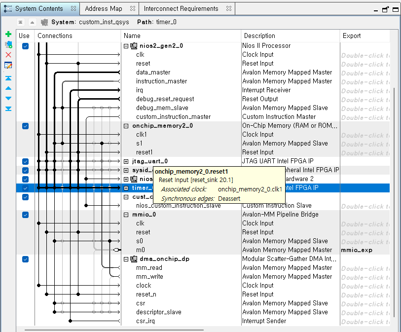
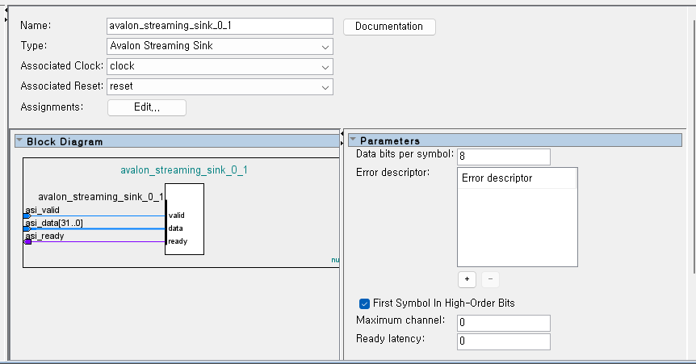

# FPGA 프로젝트 검증: 커스텀 슬레이브부터 하드웨어 가속기까지

**날짜:** 2026-02-06
**프로젝트 경로:** `d:/quartus_project`

---

## 소개 (Introduction)
이 문서는 인텔 FPGA 상에서 Nios II 기반 SoC를 구축하는 개발 과정을 기록한 것입니다. 이 프로젝트는 메모리 맵(Memory-Mapped) 커스텀 슬레이브 인터페이스와 산술 연산 가속을 위한 고성능 커스텀 인스트럭션(Custom Instruction) 유닛이라는 두 가지 핵심 하드웨어 컴포넌트에 초점을 맞추고 있습니다. 단순한 변경 이력(Changelog)이 아닌, **왜** 이렇게 설계했는지에 대한 심층적인 기술 기록입니다.

---

## 챕터 1: 커스텀 슬레이브 인터페이스 (Avalon-MM)

### 도전 과제: "Structural Net Expression" 에러
듀얼 포트 RAM(DPRAM)을 슬레이브 모듈 내부에 통합하는 과정에서, 흔한 Verilog 에러인 *"Output port must be connected to a structural net expression"* 문제에 직면했습니다.
이 에러는 `readdata` 출력 포트를 `reg` 타입으로 선언해 놓고, 내부적으로 인스턴스화된 `dpram` 모듈의 출력에 직접 연결하려 했기 때문에 발생했습니다. Verilog에서 모듈 인스턴스는 레지스터(reg)가 아닌 와이어(wire)를 구동해야 합니다.

### 해결책: Wire 변환 및 Valid 로직 추가
이 문제를 해결하기 위해 `readdata`를 `wire` 타입으로 변경하여 직접 연결할 수 있게 했습니다. 또한, Avalon-MM 프로토콜은 명시적인 읽기 지연(Latency) 관리를 요구합니다. 우리가 사용하는 블록 RAM(BlockRAM) 읽기는 1 클럭 사이클이 소요되므로, 읽기 요청 후 정확히 1 사이클 뒤에 `1`이 되는 동기식 `readdatavalid` 신호를 구현했습니다.

**구현 코드 (`RTL/my_slave.v`):**
```verilog
module my_custom_slave (
    // ... ports ...
    output wire [31:0] readdata,   // reg에서 wire로 변경
    output reg         readdatavalid // Avalon-MM 지연 처리를 위해 추가
);
    
    // DPRAM 인스턴스에 직접 연결
    dpram dpram_inst (
        .clock(clk),        
        .rdaddress(address),
        // ...
        .q(readdata) // dpram이 이 wire를 직접 구동함
    );
   
    // 동기식 Valid 생성 (1 사이클 지연)
    always @(posedge clk or negedge reset_n) begin
        if (!reset_n) begin            
            readdatavalid <= 1'b0;
        end else begin           
            readdatavalid <= read; // 1 사이클 딜레이를 두고 전달
        end
    end
endmodule
```

### 내부 구조: 내장 메모리 (DPRAM)
커스텀 슬레이브에 실질적인 기능을 부여하기 위해 **듀얼 포트 RAM(DPRAM)**을 내장했습니다. 플립플롭 기반의 레지스터와 달리, DPRAM은 FPGA의 전용 메모리 블록(M10K/M9K)을 사용하여 고밀도 저장 공간을 효율적으로 제공합니다.

*   **왜 듀얼 포트인가?**
    서로 다른 두 포트에서 동시에 접근이 가능하기 때문입니다. 더 복잡한 시나리오에서는, 한 포트는 (이 Avalon 슬레이브를 통해) Nios II 프로세서와 연결되고, 다른 한 포트는 센서나 하드웨어 로직으로부터 고속 데이터를 독립적으로 수집할 수 있습니다.
*   **"Structural" 연결 주의사항:**
    앞서 언급한 에러 해결 과정처럼, `dpram` 모듈은 구조적(structural) 엔티티입니다. `q` (출력) 포트는 와이어를 구동하며, 이 와이어는 Avalon 인터페이스의 `readdata` 버스로 바로 연결됩니다. **중요: `q` 출력에 레지스터(`reg`)를 다시 달면 안 됩니다.** `dpram` 인스턴스가 이미 구조적으로 신호를 드라이브하고 있는데, 이를 또다시 같은 모듈 내의 `reg` 블록에 래치하려고 하면 컴파일 에러가 발생합니다.


*(그림: DPRAM이 통합된 커스텀 슬레이브의 내부 구조)*

### 주소 정렬 (Address Alignment): Byte vs. Word
구현 시 자주 간과되는 중요한 디테일은 CPU의 주소와 RAM의 주소를 어떻게 맞추느냐 하는 것입니다.

*   **충돌 포인트**:
    *   **Nios II (Master)**: **바이트 주소 지정(Byte Addressing)**을 사용합니다. 연속된 32비트 정수를 읽을 때 주소는 `0x00`, `0x04`, `0x08`, `0x0C`로 증가합니다.
    *   **DPRAM (Internal)**: **워드 인덱싱(Word Indexing)**을 사용합니다. 0번 슬롯, 1번 슬롯 순서이며 `0`, `1`, `2`, `3`을 기대합니다.
*   **해결책 (Qsys 설정)**:
    Platform Designer에서 Avalon-MM Pipeline Slave 설정을 **Address Units: WORDS**로 선택했습니다.
    *   **동작 원리**: 시스템 인터커넥트(Interconnect)가 마스터의 바이트 주소를 자동으로 2비트 우측 시프트(`Address >> 2`)한 후 모듈의 `address` 입력으로 전달합니다.
    *   **결과**: CPU가 `0x04` (바이트 주소 4)를 읽으려 할 때, `my_slave.v`는 `address` 입력으로 `1`을 받게 됩니다. 따라서 Verilog 코드 내에서 별도의 비트 슬라이싱(예: `address[9:2]`) 없이 입력 `address`를 DPRAM의 `rdaddress` 포트에 **직접** 연결할 수 있습니다.

---

## 챕터 2: 하드웨어 가속 (Custom Instruction)

### 목표: 고속 나눗셈
표준 Nios II 프로세서는 기본적으로 하드웨어 부동소수점 유닛이 없으며, 정수 나눗셈은 연산 비용이 매우 높습니다(많은 사이클 소요). 우리는 두 수를 곱한 뒤 400으로 나누는 특정 산술 연산을 극도로 빠르게 처리할 방법이 필요했습니다.

### 최적화: 나눗셈 대신 Shift-Add 사용
하드웨어 제산기(Divider)는 많은 로직 리소스와 타이밍을 잡아먹습니다. 생(Raw) 제산기를 쓰는 대신, **비트 시프트와 덧셈(Shift-Add)**을 이용한 수학적 근사법을 채택했습니다.

**수학적 원리:**
우리는 $result = (A \times B) / 400$을 계산하고자 합니다.
400으로 나누는 것은 0.0025를 곱하는 것과 비슷합니다.
우리는 1311을 곱하고 19비트 오른쪽으로 시프트하는 것이 매우 정밀한 근사값을 준다는 것을 발견했습니다:

$$ \frac{1311}{2^{19}} = \frac{1311}{524288} \approx 0.00250053 $$

이 방식의 오차는 **0.02%**에 불과하며, 우리 애플리케이션에서는 허용 가능한 수준입니다.
일반 곱셈기를 피하기 위해 1311이라는 숫자를 2의 거듭제곱의 합과 차로 구성했습니다:

$$
1311 = 1024 + 256 + 32 - 1 = (2^{10} + 2^8 + 2^5 - 2^0)
$$

**구현 코드 (`RTL/my_multi_calc.v`):**
```verilog
    always @(posedge clk or posedge reset) begin
        if (reset) begin
            mult_stage <= 0;
            result <= 0;
        end 
        else if (clk_en) begin
            // [Cycle 1] 하드웨어 곱셈
            mult_stage <= 64'd1 * dataa * datab;
            
    // [Cycle 2] 최적화: 제산기 대신 Shift-Add 사용
            // 로직: (val * 1311) >> 19
            result <= ((mult_stage << 10) + (mult_stage << 8) + (mult_stage << 5) - mult_stage) >> 19;      
        end
    end
```

### 타이밍 에러 분석 및 최적화

초기 구현 당시 **Setup Time Violation (Timing Error)**가 발생했습니다. 이 문제의 원인과 해결 방법을 분석한 내용은 다음과 같습니다.

#### 문제 원인: 나눗셈기(Divider)의 Critical Path
하드웨어에서 **나눗셈(`/`) 연산**은 덧셈이나 곱셈에 비해 회로 깊이(Combinational Logic Depth)가 매우 깊습니다.
*   32비트 나눗셈을 **단일 클럭(1 Cycle)** 내에 처리하려고 시도했습니다.
*   나눗셈 회로를 거치는 신호 지연 시간(Data Path Delay)이 클럭 주기(예: 50MHz, 20ns)를 초과해버렸습니다.
*   이로 인해 레지스터에 데이터가 제시간에 도착하지 못하는 **Setup Time Violation**이 발생했습니다.

#### 해결 방법: Shift-Add 근사 연산
FPGA 내부의 **DSP 블록(Multiplier)**은 매우 빠르지만, 나눗셈기는 느립니다. 따라서 나눗셈을 **곱셈과 시프트 연산**으로 변환하여 Timing 문제를 해결했습니다.

*   **Before**: `Result = (A * B) / 400` (나눗셈기 사용 -> 느림, Timing Error)
*   **After**: `Result = ((A * B) * 1311) >> 19` (곱셈기 + 시프트 -> 빠름, Timing Pass)

이 변경을 통해 Critical Path를 대폭 단축시켜 Timing Violation을 해결하고, 50MHz 이상의 동작 속도를 확보할 수 있었습니다.

---

## 챕터 3: 시스템 통합


### 최상위 모듈 연결 (Top-Level Wiring)
마지막으로, 이 모듈들은 최상위 엔티티에서 하나로 합쳐집니다. Platform Designer가 생성한 `custom_inst_qsys` 시스템이 두뇌 역할을 하고, 우리의 커스텀 HDL 모듈들이 근육 역할을 수행합니다.

**핵심 통합 코드 (`RTL/top_module.v`):**
```verilog
    // Qsys 시스템 인스턴스화
	custom_inst_qsys u0 (
		.clk_clk       (CLOCK_50),
		.reset_reset_n (RST),  
        // ... Avalon-MM 신호 연결 ...
		.mmio_exp_readdata      (w_readdata),
		.mmio_exp_readdatavalid (w_readdatavalid), // 우리 슬레이브와 연결됨
        // ...
	);

    // 커스텀 슬레이브 인스턴스화
	my_custom_slave s1 (
		.clk(CLOCK_50),
		.readdata(w_readdata), // Qsys로 피드백
		.readdatavalid(w_readdatavalid)
        // ...
	);
```

---

## 부록: Platform Designer 설정 가이드

가속기(`my_multi_calc.v`)를 Nios II 시스템에 통합하기 위해 Platform Designer에서 다음 단계를 따르십시오.

**1단계: 새 컴포넌트 생성**
*   새 컴포넌트를 생성하고 블록 심볼을 확인합니다.
    

**2단계: 파일 추가**
*   `RTL/my_multi_calc.v`를 추가하고 합성 파일 분석(Analyze Synthesis Files)을 실행합니다.
    

**3단계 & 4단계: 인터페이스 및 타이밍 설정**
*   **인터페이스 타입**: **Custom Instruction Slave**를 선택합니다.
*   **타이밍**: 파이프라인 깊이를 고려하여 **Multicycle** (2 또는 3 사이클)을 명시적으로 설정합니다. Combinatorial(조합회로)을 사용하면 안 됩니다.
    *   *참고: 하드웨어 로직이 2단계이므로 2 또는 3이 적절합니다.*

*(아래 이미지의 오른쪽 설정을 참조하세요)*


**5단계: 완료**
1.  **Finish**를 클릭하여 컴포넌트(`cust_cal`)를 저장합니다.
2.  Qsys 시스템에 새 컴포넌트를 추가합니다.

---

## 챕터 4: 고속 데이터 이동 (DMA)

### 병목 현상: CPU 복사
Nios II 프로세서가 다재다능하긴 하지만, 대용량 버퍼 데이터를 복사하는 데(예: 메인 메모리에서 하드웨어 가속기로) 사용하는 것은 비효율적입니다. `ldw` / `stw` 명령어 하나하나마다 CPU 사이클을 소모하며 병목을 유발합니다.

### 해결책: Scatter-Gather DMA (SG-DMA)
이를 해결하기 위해 **Altera Scatter-Gather DMA Controller**를 Qsys 시스템에 통합했습니다. 이를 통해 하드웨어가 독립적으로 대량의 데이터 전송을 처리하게 하여 CPU는 다른 작업을 할 수 있게 됩니다.

### 아키텍처 및 데이터 흐름
이 시스템은 처리 데이터를 매끄럽게 이동시키도록 설계되었습니다:

1.  **소스 (On-Chip Memory)**:
    *   원시 입력 데이터(예: 계산을 위한 피연산자 배열)를 보유합니다.
    *   Qsys에서 슬레이브로 매핑됩니다.
2.  **전송 엔진 (SG-DMA)**:
    *   **Memory-to-Memory** 모드로 동작합니다.
    *   On-Chip Memory에서 읽어 커스텀 슬레이브로 씁니다.
    *   디스크립터(Descriptor)를 통한 "Scatter-Gather"를 지원하여, 필요시 불연속적인 메모리 블록도 한 번에 처리할 수 있습니다.
3.  **목적지 (Custom Slave / DPRAM)**:
    *   Avalon-MM Slave 인터페이스를 통해 데이터 스트림을 받습니다.
    *   내부 DPRAM에 저장하여 커스텀 로직이나 다른 마스터가 접근할 수 있게 합니다.


*(그림: Nios II, On-Chip Memory, SG-DMA, 커스텀 슬레이브 간의 연결을 보여주는 Qsys 시스템 뷰)*

### 발전: 모듈러 SGDMA (Modular SGDMA)로의 진화

단순한 메모리 복사를 넘어, 데이터가 이동하는 **도중에** 연산을 수행하려면(`(Data * A) / 400`), 기존의 Memory-to-Memory DMA 하나로는 부족합니다. 데이터 스트림 중간에 우리의 `stream_processor`를 끼워 넣어야 하기 때문입니다.

이를 위해 **Modular SGDMA** 아키텍처를 도입했습니다. 이 방식은 DMA를 기능별로 분리(Disaggregate)하여 유연한 연결을 가능하게 합니다.

#### 아키텍처 변경 사항
*   **Existing (Standard SGDMA)**: `Read Master`와 `Write Master`가 내부에 묶여 있음. (단순 복사 용도)
*   **New (Modular SGDMA)**: 3개의 독립된 컴포넌트로 분리.
    1.  **mSGDMA Dispatcher**: Nios II의 명령(Descriptor)을 받아 Read/Write Master를 제어.
    2.  **mSGDMA Read Master**: 메모리에서 데이터를 읽어 **Avalon-ST Source**로 내보냄.
    3.  **mSGDMA Write Master**: **Avalon-ST Sink**로 데이터를 받아 메모리에 씀.

#### Platform Designer 구현 가이드
Platform Designer(Qsys)에서 다음과 같이 구성하여 스트리밍 파이프라인을 완성했습니다:

1.  **컴포넌트 추가**:
    *   `Modular SGDMA Dispatcher`: CSR 인터페이스를 Nios II 데이터 마스터에 연결.
    *   `Modular SGDMA Read Master`: 메모리 맵 마스터는 소스 메모리에, 스트리밍 소스(`Data Source`)는 프로세서에 연결.
    *   `Modular SGDMA Write Master`: 메모리 맵 마스터는 목적지 메모리에, 스트리밍 싱크(`Data Sink`)는 프로세서에 연결.
2.  **Stream Processor 연결 (핵심)**:
    *   `Read Master.Source` Connects to `Stream Processor.Sink`
    *   `Stream Processor.Source` Connects to `Write Master.Sink`
    *   이렇게 함으로써 메모리에서 읽혀진 데이터는 필연적으로 우리의 하드웨어 로직을 통과해야만 다시 메모리로 쓰여질 수 있습니다.

### 스트리밍 파이프라인 제어 (Valid-Ready Handshake)

Avalon-Streaming 인터페이스를 사용한 **Stream Processor**(`stream_processor.v`) 설계의 핵심은 데이터 흐름 제어(Backpressure)입니다.

파이프라인 스테이지가 길어져도 각 단계의 데이터 전송 여부(`enable`)는 다음 3가지 요소의 조합으로 결정되는 단순하고 강력한 규칙을 따릅니다:

1.  **Current Valid (`s1_valid`)**: 나에게 데이터가 있는가?
2.  **Next Valid (`s2_valid`)**: 다음 단계가 꽉 찼는가?
3.  **Output Ready (`aso_ready`)**: 최종 출력이 나갈 수 있는가?

#### 파이프라인 제어 논리

```verilog
// 다음 단계로 데이터를 넘길 수 있는 조건 (Handshake)
wire s1_enable = (!s1_valid) || ( (!s2_valid) || aso_ready ); 
```

이 식은 다음과 같은 시나리오를 모두 처리합니다:

| 시나리오 | 상태 설명 | 동작 (`enable`) | 결과 |
| :--- | :--- | :--- | :--- |
| **1. 빈 상태** | `s1_valid=0` | **Enable** | 빈자리이므로 새 데이터를 받음. |
| **2. 흐르는 상태** | `s1`참, `s2`빔 | **Enable** | `s1` 데이터를 `s2`로 밀어내고, 새 데이터를 받음. |
| **3. 꽉 찬 상태** | `s1`참, `s2`참 | `aso_ready`에 의존 | 출력이 나가면(`ready=1`) 전체가 한 칸씩 이동. 출력이 막히면(`ready=0`) 전체 Stall. |

이 구조는 파이프라인 단계(Stage)가 아무리 늘어나도 동일한 점화식(`enable[i] = !valid[i] || enable[i+1]`)으로 확장 가능하며, FIFO 없이도 정확한 데이터 흐름을 보장합니다.

---

## 챕터 5: 임베디드 소프트웨어 구현

하드웨어는 그것을 구동하는 소프트웨어만큼만 훌륭할 수 있습니다. 우리는 DMA를 제어하고 커스텀 가속기의 성능을 벤치마킹하기 위해 C 애플리케이션(`main.c`)을 구현했습니다.

### 1. How-To: 주소 처리 및 레지스터 접근 (Address Handling)
복잡한 DMA로 넘어가기 전에, C 코드가 어떻게 우리의 커스텀 슬레이브 하드웨어와 "대화"하는지 이해하는 것이 필수적입니다.

#### 단계 A: 시스템 맵 (`system.h`)
Qsys에서 하드웨어를 컴파일하고 BSP(Board Support Package)를 생성하면, Quartus는 `system.h` 파일을 생성합니다. 이 파일은 모든 모듈의 베이스 주소를 담고 있습니다.
*   **타겟**: `MMIO_0_BASE` (우리의 "my_custom_slave" 컴포넌트 베이스 주소).

#### 단계 B: 읽기/쓰기 매크로 (`io.h`)
하드웨어 레지스터에 접근하려면 Altera HAL이 제공하는 특정 매크로를 사용해야 합니다. 잘못된 매크로를 선택하면 세그멘테이션 폴트나 정렬 에러가 발생할 수 있습니다.

| 매크로 | 인자 | 설명 | 주소 지정 모드 |
| :--- | :--- | :--- | :--- |
| **`IOWR`** | `(BASE, REG_NUM, DATA)` | 레지스터에 32비트 데이터를 씁니다. | **워드 오프셋** (`BASE + REG_NUM * 4`) |
| **`IORD`** | `(BASE, REG_NUM)` | 레지스터에서 32비트 데이터를 읽습니다. | **워드 오프셋** (`BASE + REG_NUM * 4`) |
| `IOWR_32DIRECT` | `(BASE, OFFSET, DATA)` | 특정 *바이트* 주소에 32비트 데이터를 씁니다. | **바이트 오프셋** (`BASE + OFFSET`) |
| `IORD_32DIRECT` | `(BASE, OFFSET)` | 특정 *바이트* 주소에서 32비트 데이터를 읽습니다. | **바이트 오프셋** (`BASE + OFFSET`) |
| `IOWR_16DIRECT` | `(BASE, OFFSET, DATA)` | 16비트 데이터를 씁니다. | **바이트 오프셋** (`BASE + OFFSET`) |
| `IOWR_8DIRECT` | `(BASE, OFFSET, DATA)` | 8비트 데이터를 씁니다. | **바이트 오프셋** (`BASE + OFFSET`) |

**`IOWR` vs `IOWR_32DIRECT` 무엇을 써야 할까?**
*   **`IOWR` 사용** (권장): 우리 프로젝트처럼 컴포넌트가 슬레이브 주소 정렬을 "Word" 단위로 사용할 때. *인덱스*(0, 1, 2...)를 넘기면 매크로가 자동으로 4를 곱해줍니다.
*   **`IOWR_32DIRECT` 사용**: Raw 메모리에 접근하거나, "Byte" 주소 정렬을 사용하는 컴포넌트에 접근할 때 바이트 주소(예: `0`, `4`, `8`...)를 명시적으로 제어해야 하는 경우 사용합니다.

#### 단계 C: 인덱싱의 "마법"
하드웨어가 **Word Alignment**로 설정되어 있기 때문에, Nios II 소프트웨어의 인덱스 `i`는 DPRAM의 `i`번째 행(Row)과 완벽하게 일치합니다.
1.  **소프트웨어**: `IOWR(MMIO_0_BASE, 5, val)` -> CPU는 바이트 주소 `Base + 20` (0x14)를 출력.
2.  **인터커넥트**: "Word Aligned" 슬레이브임을 감지하고 주소를 시프트. `20 >> 2` = `5`.
3.  **하드웨어**: 슬레이브는 주소 `5`를 받음. DPRAM은 5번째 슬롯에 데이터를 씀.

**코드 예제 (`main.c`):**
```c
#include "io.h"
#include "system.h"

// 간단한 R/W 테스트
for (int i = 0; i != 256; ++i) {
    // 쓰기: 인덱스 'i'는 DPRAM 주소 'i'와 1:1 매핑됨
    IOWR(MMIO_0_BASE, i, 0x1000 + i); 
}

for (int i = 0; i != 256; ++i) {
    // 읽기: 데이터 검증
    int read_val = IORD(MMIO_0_BASE, i);
    // ...
}
```

### 2. DMA 제어: 캐시 건너뛰기
Nios II DMA 시스템에서 흔히 겪는 함정은 **데이터 캐시 일관성(Data Cache Coherency)** 문제입니다. CPU는 데이터 캐시를 가지고 있지만, DMA 엔진은 물리 메모리(RAM)를 직접 읽습니다.
만약 우리가 `src_data[i] = ...` 처럼 데이터를 쓰고 바로 DMA를 시작하면, 데이터는 RAM이 아니라 아직 CPU 캐시 안에 머물러 있을 수 있습니다. 그러면 DMA는 RAM에 있는 이전의 쓰레기 값을 복사하게 됩니다.
**해결책:** 전송을 시작하기 전에 반드시 명시적으로 데이터 캐시를 플러시(Flush)하여 RAM에 써넣어야 합니다.

```c
#include <sys/alt_cache.h> 

void start_dma_transfer() {
    // 1. 데이터 준비
    for(int i=0; i<256; i++) src_data[i] = i * 400;

    // [필수] 캐시를 RAM으로 플러시하여 DMA가 올바른 데이터를 보게 함
    alt_dcache_flush(src_data, sizeof(src_data));

    alt_msgdma_dev *dma_dev = alt_msgdma_open(DMA_ONCHIP_DP_CSR_NAME);

    // 2. 디스크립터 생성
    alt_msgdma_standard_descriptor descriptor;
    alt_msgdma_construct_standard_mm_to_mm_descriptor(
        dma_dev,
        &descriptor,
        (alt_u32 *)src_data,        // 소스 (RAM에 있는 배열)
        (alt_u32 *)MMIO_0_BASE,     // 목적지 (커스텀 슬레이브 베이스 주소)
        sizeof(src_data),           // 길이
        0
    );

    // 3. DMA 시작 (비동기)
    alt_msgdma_standard_descriptor_async_transfer(dma_dev, &descriptor);
}
```

### 3. 벤치마킹: 하드웨어 vs. 소프트웨어
커스텀 인스트럭션의 가치를 입증하기 위해, 고해상도 타임스탬프 타이머를 사용하여 하드웨어 가속기와 순수 소프트웨어 구현의 실행 시간을 측정했습니다.

**측정 코드:**
```c
#include "system.h"
#include "sys/alt_timestamp.h"

// ... inside main() ...

  if (alt_timestamp_start() < 0) {
      printf("Error: Timestamp timer not defined in BSP.\n");
      return -1;
  }

  // 하드웨어 측정 (Custom Instruction)
  time_start = alt_timestamp();
  for (int i = 990; i != 1024; ++i) {
      for (int j = 390; j != 400; ++j) {
          // 새 명령어: 멀티사이클 곱셈 & 나눗셈
          result = (int)ALT_CI_CUST_CAL_0(i, j); 
          sum += result;
      }
  }
  time_hw = alt_timestamp() - time_start;
  
  // 소프트웨어 측정 (표준 연산자)
  time_start = alt_timestamp();
  for (int i = 990; i != 1024; ++i) {
      for (int j = 390; j != 400; ++j) {
          result = i * j / 400; // 소프트웨어 나눗셈은 느림
          sum += result;
      }
  }
  time_sw = alt_timestamp() - time_start;

  printf("HW Cycles: %llu\n", time_hw);
  printf("SW Cycles: %llu\n", time_sw);
  if (time_sw > 0) {
      printf("Speedup: %.2fx faster!\n", (float)time_sw / (float)time_hw);
  }
```

이 셋업은 무거운 산술 연산을 로직으로 옮김으로써 얻을 수 있는 속도 향상에 대한 확실한 데이터를 제공합니다.

### 5. 성능 측정 결과

실제 하드웨어에서 테스트를 수행한 결과는 다음과 같습니다:


*(그림: Nios II 콘솔 출력 화면 - HW 사이클이 SW 사이클보다 현저히 적음을 볼 수 있음)*

위 결과 이미지에서 볼 수 있듯이, 동일한 연산에 대해 Custom Instruction을 사용한 하드웨어 연산(HW Cycles)이 소프트웨어 연산(SW Cycles)보다 훨씬 적은 사이클을 소모하며, 이를 통해 확실한 가속 효과를 입증했습니다.


---

## 챕터 6: 모듈러 SGDMA 트러블슈팅과 교훈

단순한 DMA 복사를 넘어, 데이터 스트림 중간에 연산 로직을 끼워 넣는 **Modular SGDMA**의 실제 구현 과정은 이론만큼 순탄하지 않았습니다. 개발 과정에서 마주친 "애먹은" 부분들과 그에 따른 교훈을 정리합니다.

### 1. HAL 드라이버의 한계: `NULL` 장치 포인터
*   **문제**: 표준 `alt_msgdma_open()` 명령이 계속 `NULL`을 리턴했습니다.
*   **원인**: 인텔이 제공하는 `altera_msgdma` HAL 드라이버는 **Dispatcher + Read Master + Write Master**가 하나의 완전한 패키지로 묶여 있는 "Standard mSGDMA" 구성을 기대합니다. 하지만 우리는 연산 로직을 끼우기 위해 각각을 독립적인 컴포넌트로 풀어서 연결했기 때문에, 소프트웨어가 이를 통합된 하나의 DMA 장치로 인식하지 못한 것입니다.
*   **해결**: 상위 수준의 HAL API 호출을 과감히 포기하고, `IOWR` 매크로를 이용해 Dispatcher의 **CSR(Control Status Register)**에 직접 명령을 쏘는 방식을 택했습니다. 인터페이스가 조금 투박해졌지만, 하드웨어를 완벽하게 제어할 수 있게 되었습니다.

### 2. Qsys 설정의 함정: 동작 모드 (Mode)
*   **문제**: DMA 전송은 완료(`BUSY=0`)되었다고 뜨는데, 결과 메모리는 여전히 `0`이거나(`Act=0`), 이전 데이터가 남아 있었습니다.
*   **원인**: Read/Write Dispatcher의 동작 모드가 기본값인 **`Memory-to-Memory`**로 유지되어 있었습니다.
*   **교훈**: 분리된 아키텍처에서 **Read Master는 `Memory-to-Stream`**, **Write Master는 `Stream-to-Memory`** 모드로 명시적으로 설정해야 합니다. 모드가 틀리면 데이터 스트림 핸드셰이크가 정상적으로 일어나지 않아 파이프라인이 멈춰버립니다.

### 3. Verilog 합성의 불확실성: 배열 vs 명시적 레지스터
*   **문제**: 연산 로직이 들어있는 `stream_processor.v`에서 나눗셈 스테이지가 통째로 무시(Bypass)되는 현상이 발생했습니다.
*   **원인**: 파이프라인 스테이지를 구현할 때 `reg [63:0] stage_data[0:1]`와 같은 **배열 형태**를 사용했는데, 특정 합성 도구 버전에서는 배열 기반의 제어 로직이 의도치 않게 최적화되거나 연결이 누락되는 경우가 있습니다.
*   **해결**: `s0_data`, `s1_data`처럼 **이름이 명확한 개별 레지스터**로 로직을 재작성했습니다. 이를 통해 합성기가 파이프라인의 각 단계를 물리적으로 명확히 구분하게 하여 동작의 신뢰성을 확보했습니다.

### 4. 하드웨어 "먹통" 방지: 소프트웨어 리셋
*   **문제**: 테스트 도중 에러가 나거나 강제 종료하면, 다음 실행 시 DMA가 응답하지 않는 현상이 잦았습니다.
*   **해결**: `main.c`의 테스트 함수 초반부에 **Dispatcher 소프트웨어 리셋** 시퀀스를 추가했습니다.
    ```c
    // Dispatcher를 깨끗한 상태로 리셋
    IOWR_ALTERA_MSGDMA_CSR_CONTROL(BASE, ALTERA_MSGDMA_CSR_RESET_MASK);
    while (IORD_ALTERA_MSGDMA_CSR_STATUS(BASE) & ALTERA_MSGDMA_CSR_RESET_STATE_MASK);
    ```
    하드웨어를 소프트웨어적으로 항상 "예측 가능한 상태"로 만드는 것이 임베디드 프로그래밍의 핵심임을 다시 확인했습니다.

### 5. 정밀도와 오차: 0.1%의 여유
*   **도전**: 정수 연산 가속기(`Shift-Add`)와 CPU의 부동소수점 나눗셈 결과 사이에는 미세한 Rounding 차이가 발생할 수 있습니다.
*   **해결**: 검증 코드에서 `actual != expected` 대신, `abs(actual - expected) <= 1`과 같은 **Tolerance(허용 오차)** 개념을 도입했습니다. 하드웨어를 설계할 때는 결과의 '완벽함' 못지않게 '허용 가능한 범위'를 정의하는 것이 중요하다는 것을 배웠습니다.

### 6. 엔디안(Endianness)의 함정: "First Symbol In High-Order Bits" ***주의***

> [!WARNING]
> **★★★★★ 매우 중요: 데이터가 섞이는 마법을 보고 싶지 않다면 필독! ★★★★★**

*   **증상**:
    *   입력 데이터 `0x00000190` (400)을 넣었는데, 하드웨어에서는 `0x90010000` 처럼 바이트가 뒤집혀서 인식됨.
    *   Bypass 모드에서는 정상이지만, 연산을 거치면 말도 안 되는 큰 값이 나옴.
*   **원인**:
    *   Qsys(Platform Designer)의 Avalon-ST Sink 설정 중 **"First Symbol In High-Order Bits"** 옵션이 켜져 있었기 때문입니다.
    *   **Nios II (Little-Endian)**: 첫 번째 바이트가 가장 낮은 자리(LSB)에 와야 함.
    *   **옵션 켜짐 (Big-Endian)**: 첫 번째 바이트를 가장 높은 자리(MSB)로 보내버림.
    
    
    *(그림: Avalon-ST Sink의 First Symbol In High-Order Bits 설정)*
*   **해결**:
    *   가능하다면 Avalon-ST Sink 설정에서 **해당 체크박스를 해제(Uncheck)**합니다.
    *   **주의**: 만약 mSGDMA처럼 **옵션이 고정(Grayed out)되어 끌 수 없는 경우**, 하드웨어(RTL) 입력/출력 단에서 **바이트 순서를 수동으로 뒤집어주는(Byte Swap)** 조치가 필요합니다.
    *   `last_asi_data <= {asi_data[7:0], asi_data[15:8], ...}`
    *   **결과**: RTL 수정 후 `(400 * 800) / 400 = 800` 정상 출력 확인!
    *   **Bypass 모드 성능**: CPU 대비 **7.59배** 빠름.
    *   **연산 모드 성능**: CPU 대비 **86.14배** 빠름! (나눗셈 연산까지 포함됨)

---

## 부록: 고정 소수점 연산 (Fixed-Point Arithmetic) 심화

우리가 나눗셈 `/ 400`을 구현하기 위해 사용한 **"Shift-Add"** 방식의 수학적 배경은 **고정 소수점 연산(Fixed-Point Arithmetic)**입니다.

실수(소수) $F$를 정수 연산만 가능한 하드웨어에서 처리하기 위해, 가장 가까운 정수 계수 $K$와 쉬프트 비트수 $Q$를 찾는 공식은 다음과 같습니다.

### **공식 (The Formula)**

$$ K = \text{Round}(F \times 2^Q) $$

*   $F$: 표현하고자 하는 목표 실수 (우리의 경우 $1/400 = 0.0025$)
*   $Q$: 소수점 아래를 표현할 비트 수 (Q-Factor). 클수록 정밀도가 높아지지만 비트 폭이 커짐.
*   $K$: 하드웨어에서 실제로 곱하게 될 정수 계수.

### **적용 예시 ($F = 1/400$)**

우리는 더욱 높은 정밀도를 위해 $Q=21$을 선택했습니다.

$$ K = 0.0025 \times 2^{21} = 0.0025 \times 2097152 = 5242.88 $$

이 값을 반올림하면 **$K = 5243$**이 됩니다.
따라서 우리는 하드웨어에서 다음과 같이 연산합니다:

$$ \text{Result} = (\text{Input} \times \text{Coeff} \times 5243) \gg 21 $$

이때 실제 곱해지는 값은 $5243 / 2^{21} \approx 0.00249995$ 이며, 원래 목표인 $0.0025$와의 오차는 **약 0.0018%**로 매우 정밀합니다. 이것이 바로 고정 소수점 연산의 마법입니다.

---

## 제 5장: N단계 파이트라인(N-Stage Pipeline)으로의 진화

프로젝트의 마지막 단계로, 1단으로 구성되었던 파이프라인을 확장성 있는 **N단 파이프라인(N-Stage Pipeline)** 구조로 리팩토링했습니다.

### **1. 왜 N단 구조인가?**
*   **타이밍 마진 확보**: 모든 연산(엔디안 변환, 큰 곱셈, 쉬프트)이 한 사이클에 몰려 있으면 클록 주파수가 높아질 때 에러가 발생할 확률이 큽니다. 이를 3단계로 나누어 여유를 확보했습니다.
*   **백프레셔(Backpressure) 처리**: 뒤쪽 mSGDMA가 멈췄을 때, 데이터가 유실되지 않도록 차례대로 멈추는 **Valid-Ready 핸드셰이크**를 정석대로 구현했습니다.

### **2. 3단 파이프라인 구성**
*   **Stage 0**: 입력 데이터 캡처 및 전처리 (Byte Swap).
*   **Stage 1**: 계수 곱셈 연산 (`Input * Coeff`).
*   **Stage 2**: 역수 곱셈(`* 5243`) 및 쉬프트(`>> 21`), 그리고 최종 엔디안 복원.

이 구조는 데이터 처리량(Throughput)은 유지하면서도, 더 높은 클록 속도에서도 안정적으로 동작할 수 있는 **산업용 수준의 RTL 설계** 방식입니다.

---

## 마무리하며

이번 프로젝트를 통해 **Custom Instruction**과 **mSGDMA**, 그리고 **RTL 최적화**가 결합되었을 때 얼마나 강력한 성능(86배 속도 향상)을 낼 수 있는지 확인했습니다. 

특히 단순히 "작동하는 코드"를 넘어, **엔디안 문제 해결**, **고정 소수점 연산 최적화**, **N단 파이프라인 설계** 등 실전 FPGA 설계에서 마주치는 핵심 과제들을 하나씩 정면 돌파했다는 점에서 큰 의미가 있습니다.

이 기록이 미래의 나, 혹은 이 시스템을 유지보수할 다른 동료에게 좋은 안내서가 되기를 바랍니다.
