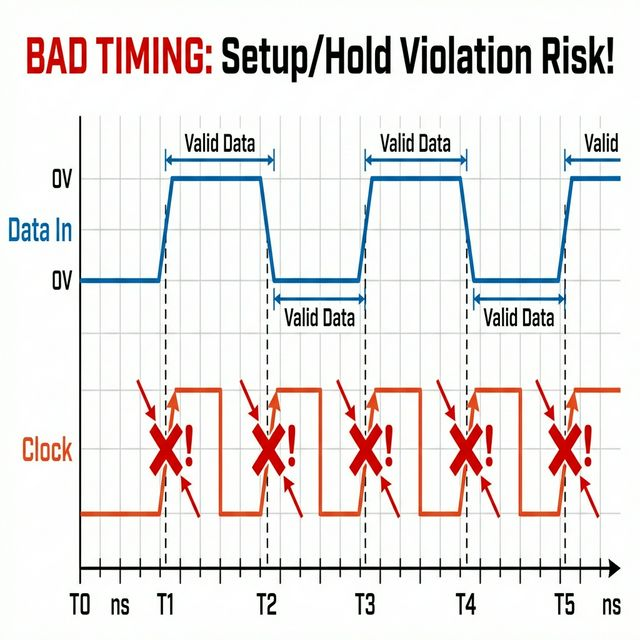
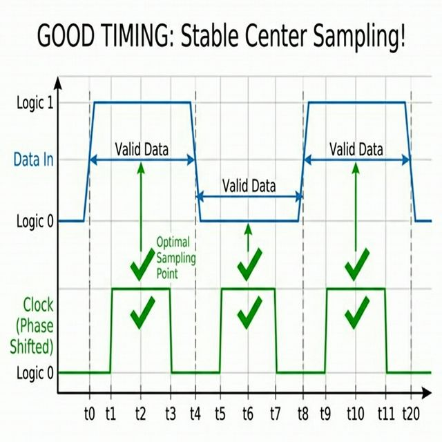

# PLL 동적 재설정 가이드 (Dynamic PLL Reconfiguration Guide)

DE10-Nano HDMI TX 프로젝트에서 해상도 변경 시 PLL을 동적으로 재설정하여 픽셀 클럭을 제어하는 방법을 정리한 문서입니다.

---

## 목차

1. [개요](#1-개요)
2. [주파수 계산 공식](#2-주파수-계산-공식)
3. [Verilog 설정값](#3-verilog-설정값)
4. [Nios II를 통한 제어](#4-nios-ii를-통한-제어)
5. [Phase Shift 제어](#5-phase-shift-제어)
6. [Phase Shift가 필요한 이유](#6-phase-shift가-필요한-이유)
7. [주의사항](#7-주의사항)

---

## 1. 개요

### 시스템 구성

```
Clock Source (50MHz) 
    ↓
[PLL IP] ← [PLL Reconfig IP] ← [Clean_pll_controller] or [Nios II]
    ↓
Variable Pixel Clock (25~148.5MHz)
```

**핵심 구성 요소:**
- **ALTPLL IP**: 실제 클럭을 생성하는 하드웨어
- **ALTPLL_RECONFIG IP**: PLL 설정을 런타임에 변경
- **Clean_pll_controller.v**: 하드웨어 FSM 제어기 (또는 Nios II로 대체 가능)

---

## 2. 주파수 계산 공식

$$F_{out} = F_{ref} \times \frac{M}{N \times C}$$

| 파라미터 | 설명 | 예시 |
|:---|:---|:---|
| $F_{ref}$ | 입력 클럭 | 50 MHz |
| $M$ | Feedback Multiplier | 27+27 = 54 |
| $N$ | Pre-Scale Divider | 3+2 = 5 |
| $C$ | Post-Scale Divider | 10+10 = 20 |

---

## 3. Verilog 설정값

### 카운터 포맷 (18-bit)

```
[17:9] High Count (9-bit)
[8:0]  Low Count (9-bit)
실제값 = High + Low
```

### 해상도별 설정 예시

#### 640x480 @ 60Hz (25 MHz)
```verilog
m_counter = 18'h1_00_00;  // Bypass (1)
n_counter = 18'h1_00_00;  // Bypass (1)  
c_counter = 18'h0_01_01;  // 1+1 = 2
// 50 × 1/(1×2) = 25 MHz
```

#### 720x480 @ 60Hz (27 MHz)
```verilog
m_counter = 18'h2_1B_1B;  // 27+27 = 54
n_counter = 18'h2_03_02;  // 3+2 = 5
c_counter = 18'h0_0A_0A;  // 10+10 = 20
// 50 × 54/(5×20) = 27 MHz
```

#### 1920x1080 @ 60Hz (148.5 MHz)
```verilog
m_counter = 18'h0_25_25;  // 37+37 = 74
n_counter = 18'h2_03_02;  // 3+2 = 5
c_counter = 18'h2_03_02;  // 3+2 = 5
// 50 × 74/(5×5) = 148 MHz
```

---

## 4. Nios II를 통한 제어

### 4.1. Qsys 연결

```
[Nios II Data Master] ──(Avalon-MM)──> [PLL Reconfig Slave]
```

### 4.2. 레지스터 맵

| Offset | 이름 | 설명 |
|:---:|:---|:---|
| 0x00 | STATUS | Bit[0]: Busy=0, Done=1 |
| 0x02 | START | Write 1 to start reconfig |
| 0x03 | N_COUNTER | N 값 |
| 0x04 | M_COUNTER | M 값 |
| 0x05 | C_COUNTER | C 값 |
| 0x08 | BANDWIDTH | 보통 0x6 (Medium) |
| 0x09 | CHARGE_PUMP | 보통 0x3 (Medium) |

### 4.3. C 코드 예시

```c
#include "io.h"
#include "system.h"

#define ADDR_M_COUNTER   0x04
#define ADDR_N_COUNTER   0x03
#define ADDR_C_COUNTER   0x05
#define ADDR_BANDWIDTH   0x08
#define ADDR_CHARGE_PUMP 0x09
#define ADDR_START       0x02
#define ADDR_STATUS      0x00

void set_pll_frequency(uint32_t m, uint32_t n, uint32_t c) {
    // Write PLL parameters
    IOWR_32DIRECT(PLL_RECONFIG_BASE, ADDR_M_COUNTER * 4, m);
    IOWR_32DIRECT(PLL_RECONFIG_BASE, ADDR_N_COUNTER * 4, n);
    IOWR_32DIRECT(PLL_RECONFIG_BASE, ADDR_C_COUNTER * 4, c);
    IOWR_32DIRECT(PLL_RECONFIG_BASE, ADDR_BANDWIDTH * 4, 6);
    IOWR_32DIRECT(PLL_RECONFIG_BASE, ADDR_CHARGE_PUMP * 4, 3);
    
    // Start reconfiguration
    IOWR_32DIRECT(PLL_RECONFIG_BASE, ADDR_START * 4, 1);
    
    // Wait for completion
    while((IORD_32DIRECT(PLL_RECONFIG_BASE, ADDR_STATUS * 4) & 0x1) == 0);
}

// 사용 예시: 27MHz로 설정
set_pll_frequency(0x21B1B, 0x20302, 0x00A0A);
```

---

## 5. Phase Shift 제어

> [!TIP]
> **Qsys에서 파라미터 미리 계산하기**
> 
> PLL IP를 Qsys에서 더블클릭하여 설정창을 열면, 원하는 출력 주파수를 입력했을 때 자동으로 M, N, C 값을 계산해줍니다. 이를 통해 실제 구현 전에 파라미터 값이 올바른지 미리 확인할 수 있습니다.

### 5.1. Dynamic Phase Shift (DPS)

PLL IP 설정에서 **Enable phase shift step** 옵션 활성화 후 사용

**제어 포트:**
- `phasestep`: 1 pulse = 1 step shift
- `phaseupdown`: 1=지연, 0=앞당김
- `phasecounterselect`: 어떤 출력(C0, C1...)을 조정할지 선택

**C 코드:**
```c
void phase_shift_step(int direction) {
    // direction: 1=delay, 0=advance
    IOWR_ALTERA_AVALON_PIO_DATA(PHASE_PIO, (direction << 1) | 0);
    IOWR_ALTERA_AVALON_PIO_DATA(PHASE_PIO, (direction << 1) | 1); // pulse
    IOWR_ALTERA_AVALON_PIO_DATA(PHASE_PIO, (direction << 1) | 0);
}
```

### 5.2. Reconfig IP를 통한 설정

초기 위상값을 변경할 때 사용하며, 빈번한 조정이 필요하면 DPS 방식을 권장합니다.

---

## 6. Phase Shift가 필요한 이유

### 문제 상황: Edge-Aligned (위험)

클럭 엣지가 데이터 전환 시점과 겹치면 **Setup/Hold Violation** 발생



### 해결 방법: Center-Aligned (안전)

Phase Shift를 통해 클럭 엣지를 데이터의 안정 구간 중앙에 배치



### HDMI TX에서의 응용

- HDMI 칩은 FPGA 클럭의 Rising/Falling Edge에서 데이터를 샘플링
- PCB 배선 지연으로 타이밍이 어긋날 수 있음
- PLL Phase Shift로 출력 클럭을 -90°, 180° 등으로 조정하여 최적 타이밍 확보

---

## 7. 주의사항

### 7.1. PLL Locked 신호 확인 필수

```verilog
// Clean_vpg.v 예시
Clean_vga_generator u_vga (
    .reset_n(pll_locked),  // PLL Lock될 때까지 리셋 유지
    ...
);
```

Reconfiguration 중에는 `locked` 신호가 Low로 떨어지므로, High가 될 때까지 대기해야 합니다.

### 7.2. Waitrequest 처리

`mgmt_waitrequest` 신호를 확인하여 IP가 준비된 상태에서만 읽기/쓰기를 수행하세요.

### 7.3. Clock Domain Crossing (CDC)

제어 로직(50MHz)과 PLL 출력(가변)은 서로 다른 클럭 도메인이므로, 신호 전달 시 **2-stage synchronizer**를 사용해야 메타스태빌리티를 예방할 수 있습니다.

---

## 참고 자료

- Intel ALTPLL Megafunction User Guide
- Intel ALTPLL_RECONFIG IP User Guide
- `Clean_pll_controller.v` 구현 코드